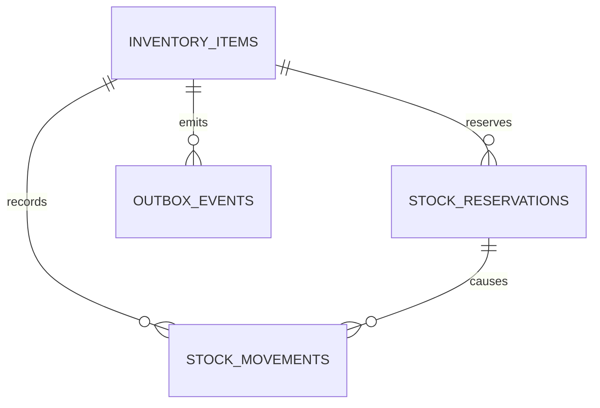

# Database — Inventory Service

> Nguồn: `docs/lld/inventory.md` · HLD `EcommercePlatform-v4(6).excalidraw` · Cập nhật: `2026-08-30`
> Baseline: MySQL 8.4/InnoDB `inventorydb` · SKU-level, một balance/SKU, atomic reservation

## 1. Quy ước chung

| Quy ước | Quyết định | Ràng buộc |
|---|---|---|
| ID | UUIDv7 API, `BINARY(16)` storage | Cross-service references không FK. |
| Quantity | `BIGINT` integer | `available ≥0`, `reserved ≥0`, max 999999999. |
| Time | `DATETIME(6)` UTC | API/event ISO-8601 UTC. |
| Lock | Optimistic locking (version) | Cập nhật với điều kiện `version` để tránh over-sell. |
| Ledger | Append-only movement | Không update/delete lịch sử. |
| Idempotency | Command key + request hash | Replay giống payload trả result cũ; khác payload conflict. |
| Observability | JSON log/W3C trace/X-Request-ID | Không log full order/address/token/payment. |

## 2. Quan hệ

## 3. Chi tiết bảng

### 3.1 `inventory_items`

| Cột | Type | Null | Ràng buộc |
|---|---|---:|---|
| `id` | BINARY(16) | N | PK. |
| `sku_id` | BINARY(16) | N | Unique, Product reference. |
| `product_id` | BINARY(16) | N | Reference để event projection. |
| `shop_id` | BINARY(16) | N | Seller scope. |
| `status` | VARCHAR(16) | N | `ACTIVE/DISABLED/ARCHIVED`. |
| `qty_available` | BIGINT | N | `≥0`. |
| `qty_reserved` | BIGINT | N | `≥0`. |
| `version` | BIGINT | N | Increment mỗi mutation. |
| `created_at/updated_at` | DATETIME(6) | N | UTC. |

### 3.2 `stock_reservations`

| Cột | Type | Ràng buộc |
|---|---|---|
| `id` | BINARY(16) PK | `reservation_id`. |
| `order_intent_id` | BINARY(16) | Order reference. |
| `idempotency_key` | VARCHAR(128) | Unique command scope. |
| `status` | VARCHAR(16) | `RESERVED/COMMITTED/RELEASED/EXPIRED`. |
| `expires_at` | DATETIME(6) | Required for RESERVED. |
| `created_at/updated_at` | DATETIME(6) | UTC. |

`stock_reservation_items(id,reservation_id,sku_id,quantity,created_at)` có unique `(reservation_id,sku_id)` và quantity integer 1–999999999.

### 3.3 `stock_movements`

Append-only: `id`, `sku_id`, `reservation_id` nullable, `order_intent_id` nullable, `delta_available`, `delta_reserved`, `reason`, `source`, `actor_user_id` nullable, `reference_id`, `occurred_at`. Tổng delta phải reconcile balance; không nhận arbitrary negative dẫn tới âm.

### 3.4 `idempotency_keys`, `outbox_events`, `inventory_audits`

- `idempotency_keys`: key, operation, caller_scope, request_hash, response_snapshot, status, expires_at; giữ 24h.
- `outbox_events`: event envelope, payload, occurred_at, published_at, attempt_count, last_error, DLQ timestamp.
- `inventory_audits`: actor/shop, operation, SKU, reason, before/after summary, trace/request ID, occurred_at; không lưu token/raw PII.

## 4. Index

| Bảng | Index |
|---|---|
| `inventory_items` | unique `sku_id`; `(shop_id,status,updated_at)`; `(product_id,status)` |
| `stock_reservations` | `(order_intent_id,status)`; `(status,expires_at)`; unique `(idempotency_key,order_intent_id)` |
| `stock_reservation_items` | unique `(reservation_id,sku_id)`; `(sku_id,reservation_id)` |
| `stock_movements` | `(sku_id,occurred_at)`; `(reservation_id,occurred_at)`; `(reference_id,reason)` |
| `idempotency_keys` | PK `(key,operation,caller_scope)`; `expires_at` |
| `outbox_events` | `(published_at,occurred_at)`; `(aggregate_type,aggregate_id,occurred_at)` |
| `inventory_audits` | `(sku_id,occurred_at)`; `(shop_id,occurred_at)` |

## 5. Enum và rules

| Rule | Giá trị |
|---|---|
| Reservation TTL | 15 phút. |
| Balance invariant | `qty_available ≥ 0`, `qty_reserved ≥ 0`. |
| Reserve | `available -= q`, `reserved += q`, cùng transaction. |
| Commit | `reserved -= q`; không tăng available. |
| Release/Expire | `reserved -= q`, `available += q`. |
| Adjustment | Chỉ thay available, reason/actor bắt buộc. |
| SKU state | Disabled/archived không reserve. |

## 6. Migration và seed

1. Tạo balance/reservation/movement/outbox/idempotency/audit tables.
2. Tạo unique indexes sau duplicate preflight.
3. Seed SKU active quantity 10, 0, disabled và reserved fixture.
4. Reconcile `available + reserved`, movement ledger và reservations.
5. Test deadlock/lock timeout/expiry job hai instance trước production.
6. Không hard-delete movement/reservation history; archive theo retention policy sau khi chốt.

## 7. Giả định & câu hỏi mở

| # | Nội dung | Ảnh hưởng nếu sai | Cần ai xác nhận |
|---|---|---|---|
| 1 | Một balance/SKU, không multi-warehouse trong v1. | Multi-warehouse cần allocation/location schema/API. | Inventory owner |
| 2 | MySQL 8.4/InnoDB optimistic locking là baseline exactness. | Ảnh hưởng failover/replication/lock semantics. | DevOps |
| 3 | Reserve TTL 15 phút align Order. | Ảnh hưởng abandoned checkout và expiry. | Order owner |
| 4 | Seller adjustment dùng delta có reason; absolute target/cycle count chưa chốt. | Ảnh hưởng audit/reconciliation trên `mfe-seller` / `mfe-admin`. | Seller/Product owner |
| 5 | Retention stock movement/reservation chưa chốt. | Ảnh hưởng storage/compliance/reconciliation window. | Finance/Platform |
