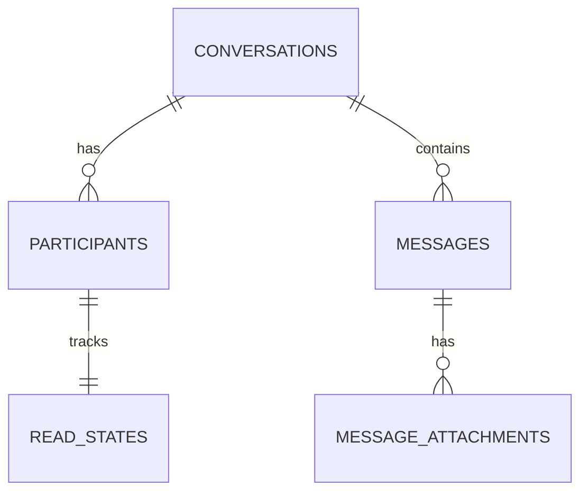

# Database — Message Service

> Nguồn: `docs/lld/message.md` · HLD/Penpot · Cập nhật: `2026-08-30`
> Baseline: MongoDB 8.x + Mongoose `messagedb`; REST + WebSocket

## 1. Quy ước chung

| Quy ước | Quyết định | Ràng buộc |
|---|---|---|
| ID | UUIDv7 string | Message sequence monotonic per conversation. |
| Time | BSON Date UTC | API/event ISO-8601 UTC. |
| Source | Conversation/message documents | WebSocket không là source of truth. |
| Attachment | Object storage bytes, metadata Mongo | Private signed URL/checksum. |
| Delete | Soft delete | History/audit vẫn giữ. |
| Observability | JSON log/W3C trace/X-Request-ID | Không log message/PII/token. |

## 2. Quan hệ

## 3. Chi tiết collection

### 3.1 `conversations`

`_id`, `type`, `status`, `participant_key`, `context_type`, `context_id`, `shop_id`, `last_message_sequence`, `last_message_at`, `created_by`, timestamps. `participant_key` deterministic/unique cho buyer-seller active thread policy.

### 3.2 `participants`

`_id`, `conversation_id`, `user_id`, `shop_id` nullable, `role`, `status`, `joined_at`, `left_at`. Unique `(conversation_id,user_id)`; seller/support scope validate ở application layer.

### 3.3 `messages`

| Field | Type | Ràng buộc |
|---|---|---|
| `_id` | string | UUIDv7. |
| `conversation_id` | string | Required. |
| `sequence` | long | Unique per conversation, monotonic. |
| `sender_id` | string | Must be participant. |
| `body` | string/null | Max 5.000, sanitize; one of body/attachment required. |
| `status` | enum | `ACCEPTED`, `EDITED`, `DELETED`, `BLOCKED`. |
| `idempotency_key` | string | Unique sender/conversation scope. |
| `created_at`/`updated_at` | Date | UTC. |

### 3.4 `message_attachments`, `read_states`, `message_audits`, `processed_events`, `outbox_events`

- `message_attachments`: media_id, message_id, object_key, type, size, sha256, status; max 6/message, 20 MiB/file.
- `read_states`: conversation_id, user_id, `delivered_sequence`, `last_read_sequence`, updated_at; unique pair, **cả hai** cursor monotonic (chỉ tăng), ràng buộc `last_read_sequence <= delivered_sequence`. `delivered_sequence` nuôi `delivery_status=DELIVERED`, `last_read_sequence` nuôi `READ`; xem `docs/api/message.md` §3.2.
- `message_audits`: actor/action/target/reason/metadata/occurred_at, append-only.
- `processed_events`: event ID/dedupe/status for inbound lifecycle events.
- `outbox_events`: event_id, topic, payload, status, retry_count, created_at; cho Outbox pattern để publish Kafka an toàn.

## 4. Index

| Collection | Index |
|---|---|
| `conversations` | unique `participant_key`; `(participant user lookup)` via participants; `(shop_id,last_message_at)`; `(status,last_message_at)` |
| `participants` | unique `(conversation_id,user_id)`; `(user_id,status,conversation_id)` for participant lookup |
| `messages` | unique `(conversation_id,sequence)`; unique `(sender_id,conversation_id,idempotency_key)`; `(conversation_id,created_at)` |
| `message_attachments` | `(message_id,status,sort_order)`; unique `object_key`; `(message_id,sha256)` |
| `read_states` | unique `(conversation_id,user_id)` |
| `message_audits` | `(target_id,occurred_at)`; `(actor_user_id,occurred_at)` |
| `processed_events` | unique `event_id` |
| `outbox_events` | `(status,created_at)` |

## 5. Enum và rules

Conversation `BUYER_SELLER/SUPPORT/ORDER_CONTEXT`; status `ACTIVE/ARCHIVED/CLOSED/BLOCKED`; message `ACCEPTED/EDITED/DELETED/BLOCKED`; attachment `UPLOADING/SCANNING/READY/REJECTED/DELETED`.

Enum message ở trên là trạng thái **nội dung**, phơi ra API dưới tên `moderation_status`. Trạng thái **giao nhận** (`SENT/DELIVERED/READ`) **không** lưu trên document message — nó được suy ra lúc đọc từ hai cursor trong `read_states`. Không thêm cột status giao nhận vào `messages`.

## 6. Migration và seed

### 6.1 Thứ tự migration

| Thứ tự | Nội dung | Phụ thuộc |
|---:|---|---|
| 001 | Tạo collection `conversations` + validator (`type`/`status` enum) | — |
| 002 | Tạo collection `participants` | `conversations` |
| 003 | Tạo collection `messages` + validator (`status` enum) | `conversations`, `participants` |
| 004 | Tạo collection `message_attachments` | `messages` |
| 005 | Tạo collection `read_states` | `conversations`, `participants` |
| 006 | Tạo collection `message_audits` | — |
| 007 | Tạo collection `processed_events`, `outbox_events` | — |
| 008 | Tạo unique index `participant_key` trên `conversations`, `(conversation_id,user_id)` trên `participants`/`read_states`, `(conversation_id,sequence)` trên `messages`, `object_key` trên `message_attachments`, `event_id` trên `processed_events` — sau duplicate preflight, migration fail nếu còn collision | Tất cả collection trên |
| 009 | Seed fixture cho local/test (§6.2) | Tất cả collection trên |

### 6.2 Seed tối thiểu cho local/test

| Seed | Giá trị |
|---|---|
| `conversations` | 1 `BUYER_SELLER` `ACTIVE`; 1 `SUPPORT` `ACTIVE`; 1 `ORDER_CONTEXT`; 1 `ARCHIVED`. |
| `participants` | Đủ 2 participant (buyer + seller) cho mỗi conversation `BUYER_SELLER`/`ORDER_CONTEXT`; 1 `SUPPORT_AGENT` cho conversation `SUPPORT`. |
| `messages` | Mỗi conversation có ≥3 message tăng dần `sequence`; 1 message `EDITED`; 1 message `DELETED` (verify placeholder `body:null`); 1 message có `attachment_ids`. |
| `message_attachments` | 1 `READY`; 1 `SCANNING` (chưa public); 1 `REJECTED`; 1 `UPLOADING`. |
| `read_states` | 1 cặp `delivered_sequence == last_read_sequence` (đã đọc hết); 1 cặp `last_read_sequence < delivered_sequence` (đã nhận, chưa đọc) — dùng test `delivery_status` suy ra đúng `DELIVERED` vs `READ`. |
| `processed_events` | 1 event đã xử lý — test dedupe không xử lý lại. |

Không seed nội dung message/PII thật; dùng placeholder tiếng Việt trung tính.

### 6.3 Kiểm tra bắt buộc trước khi chạy migration production

1. Verify participant isolation: mỗi `(conversation_id,user_id)` unique, không user nào join 2 lần cùng conversation.
2. Verify `sequence` monotonic, không gap/trùng trong cùng `conversation_id` trước khi tạo unique index.
3. Verify không `idempotency_key` trùng cho cùng `(sender_id,conversation_id)`.

## 7. Giả định & câu hỏi mở

| # | Nội dung | Ảnh hưởng nếu sai | Cần ai xác nhận |
|---|---|---|---|
| 1 | MongoDB/NestJS + REST/WebSocket theo lựa chọn 2A. | Ảnh hưởng socket infra/Gateway. | Tech lead |
| 2 | Buyer-seller/support; group chat chưa v1. | Ảnh hưởng participant model. | Product owner |
| 3 | Attachment 20 MiB/6 files/message, scan provider chưa chốt. | Ảnh hưởng storage/security. | Security/DevOps |
| 4 | Edit window 15 phút và retention chưa chốt. | Ảnh hưởng update/cleanup. | Product/Security |
