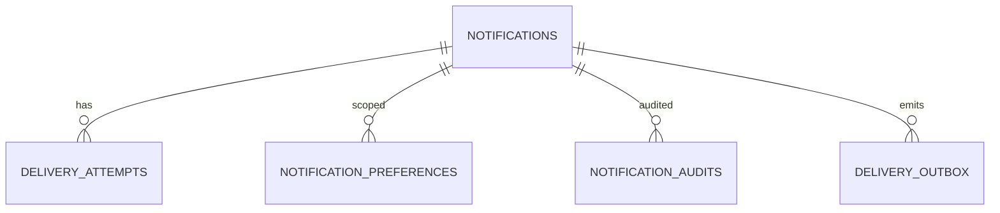

# Database — Notification Service

> Nguồn: `docs/lld/notification.md` · HLD/Penpot · Cập nhật: `2026-08-30`
> Baseline: MySQL 8.x + TypeORM `notificationdb`; Email + In-app

## 1. Quy ước chung

| Quy ước | Quyết định | Ràng buộc |
|---|---|---|
| ID | UUIDv7 string | Dedupe key/event ID unique. |
| Time | DATETIME UTC | API/event ISO-8601 UTC. |
| Source | Kafka command/event | Notification không là order/payment source. |
| Payload | Template data allowlist | Không lưu secret/OTP/password/payment credential. |
| Retention | Notification/log theo policy | Không TTL khi chưa chốt archive/compliance. |
| Observability | JSON log/W3C trace/X-Request-ID | Redact recipient/body/PII. |

## 2. Quan hệ

## 3. Chi tiết bảng

### 3.1 `notifications`

| Field | Type | Ràng buộc |
|---|---|---|
| `_id` | string | UUIDv7. |
| `recipient_user_id` | string | Required Auth reference. |
| `channel` | enum | `EMAIL`, `IN_APP`. |
| `template_key`/`template_version` | string/int | Allowlist/versioned. |
| `dedupe_key` | string | Unique theo recipient/template/campaign policy. |
| `source_event_id` | string | Kafka event/command reference. |
| `data` | object | Validated allowlist, redacted fields only. |
| `status` | enum | `QUEUED`, `PROCESSING`, `SENT`, `FAILED`, `SKIPPED`, `EXPIRED`. |
| `read_status` | enum | In-app `UNREAD/READ`; null với email. |
| `scheduled_at`/`sent_at` | Date | UTC. |
| `created_at`/`updated_at` | Date | UTC. |
| `recipient_encrypted` | text | Recipient email/phone mã hoá AES-256-GCM (không lưu plaintext); null với `IN_APP`. |
| `recipient_hash` | char(64) | HMAC-SHA256 của recipient (filter admin, không lộ thô). |
| `category` | enum | `ORDER`/`SHIPMENT`/`PAYMENT`/`REVIEW`/`CONVERSATION`/`SHOP`/`SECURITY`/`MARKETING`. |
| `reference_type`/`reference_id` | enum/string | Deep-link reference (nullable). |
| `processing_started_at` | Date | DATETIME(6), nullable. Lease cho atomic claim; sweeper chỉ reclaim khi lease đã quá `staleBefore`. |

### 3.2 `delivery_attempts`

`_id`, `notification_id`, `attempt_no`, `provider`, `status`, `provider_message_id` masked, `error_code`, `started_at`, `finished_at`, `trace_id`, `request_id`. Không lưu rendered body/raw provider response.

### 3.3 `notification_preferences`

`_id`, `user_id`, `channel`, `category`, `status`, `updated_at`, `version`. Unique `(user_id,channel,category)`. Security-critical Auth notification có thể bypass disable theo policy.

### 3.4 `templates`, `notification_audits`, `processed_events`

- `templates`: key/version/locale/subject/body safe/status/created_at; template published immutable.
- `notification_audits`: actor/action/target/reason/metadata/occurred_at; no secret/body.
- `processed_events`: event_id/dedupe_key/processed_at/status/error; unique event ID.

### 3.5 `delivery_outbox`

`_id` (event ID, UUIDv7), `aggregate_id` (→ `notifications._id`), `event_type` (`notification.delivered`/`notification.failed`), `payload` (JSON — toàn bộ delivery status event: `dedupeKey`/`notificationId`/`channel`/`templateKey`/`errorCode`/`occurredAt`), `created_at`, `published_at` (nullable, null tới khi relay worker publish thành công), `retry_count` (default `0`, tăng khi relay publish lỗi). Transactional outbox: ghi cùng 1 transaction với đổi `status` của `notifications` + tạo `delivery_attempts`, để relay worker publish Kafka (`notification.delivered.v1`/`notification.failed.v1`) sau mà không mất event nếu crash giữa persist và publish.

> Toàn bộ bảng trên là **MySQL** (`notificationdb`), không phải MongoDB — chữ "collection" ở các bản trước là gõ nhầm thuật ngữ, giữ nguyên schema/field như trên nhưng đọc là **bảng**.

## 4. Index

| Bảng | Index |
|---|---|
| `notifications` | unique `(recipient_user_id,dedupe_key,channel)`; `(recipient_user_id,created_at)`; `(recipient_user_id,read_status,created_at)`; `(status,scheduled_at)`; `(recipient_hash)`; `(status,processing_started_at)` (phục vụ `tryClaimProcessing`/`findPendingDelivery`) |
| `delivery_attempts` | `(notification_id,attempt_no)`; `(status,started_at)` |
| `notification_preferences` | unique `(user_id,channel,category)` |
| `templates` | unique `(key,version,locale)`; `(key,status)` |
| `processed_events` | unique `event_id`; unique `dedupe_key`; `(processed_at)` |
| `notification_audits` | `(target_id,occurred_at)`; `(actor_user_id,occurred_at)` |
| `delivery_outbox` | `(published_at,created_at)` (relay worker lấy batch event chưa publish, order theo `created_at`) |

## 5. Enum và rules

Channel `EMAIL/IN_APP`; status `QUEUED/PROCESSING/SENT/FAILED/SKIPPED/EXPIRED`; retry max 3; no raw secret/template body in logs/events; unread count không âm.

## 6. Migration và seed

### 6.1 Thứ tự migration

| Thứ tự | Nội dung | Phụ thuộc |
|---:|---|---|
| 001 | Tạo database `notificationdb`, charset/collation, migration metadata | — |
| 002 | Tạo bảng `templates` (unique `(key,version,locale)`) | — |
| 003 | Tạo bảng `notifications` | `templates` |
| 004 | Tạo bảng `delivery_attempts`, FK → `notifications` | `notifications` |
| 005 | Tạo bảng `notification_preferences` (unique `(user_id,channel,category)`) | — |
| 006 | Tạo bảng `notification_audits` | — |
| 007 | Tạo bảng `processed_events` (unique `event_id`, unique `dedupe_key`) | — |
| 008 | Thêm index `(recipient_user_id,dedupe_key,channel)` unique, `(recipient_user_id,created_at)`, `(status,scheduled_at)` trên `notifications` | `notifications` |
| 009 | Seed template v1 + fixture cho local/test (§6.2) | Tất cả bảng trên |
| 010 | Thêm index `(status,processing_started_at)` trên `notifications`, phục vụ `tryClaimProcessing`/`findPendingDelivery` | 009 |

> Lưu ý (ngoài phạm vi cập nhật lần này): trên code thực tế, cột `processing_started_at`, bảng `delivery_outbox` (§3.5, §4) và mở rộng enum `delivery_attempts.status` (`SKIPPED`, `RETRY_EXHAUSTED` — chưa cập nhật ở §5) đều được thêm cùng lúc ở migration `1750000000009-delivery-hardening.ts` — nhưng dòng 009 ở bảng trên vẫn đang mô tả seed, không phải delivery-hardening; số thứ tự migration giữa docs và code đang lệch nhau. Migration 010 (index mới) phụ thuộc đúng vào migration thêm cột `processing_started_at` đó, dù số thứ tự trong docs chưa khớp code.

### 6.2 Seed tối thiểu

| Seed | Giá trị |
|---|---|
| `templates` | `order-success-v1`, `payment-received-v1`, `order-cancelled-v1`, `invoice-issued-v1`, `shipment-delivered-v1`, `shipment-failed-v1`, `payment-result-v1`, `payout-result-v1`, `auth-verification-v1`, `auth-email-verification-v1`, `auth-password-reset-v1`, `review-request-v1` — mỗi template locale `vi-VN`, `status=PUBLISHED`. |
| `notification_preferences` | 1 user với `category=SECURITY,locked=true` (test không opt-out được); 1 user tắt `category=MARKETING`. |
| `notifications` | 1 `SENT` in-app `read_status=UNREAD`; 1 `SENT` đã `READ`; 1 `FAILED` sau 3 lần retry; 1 `SKIPPED` (do preference disabled). |
| `delivery_attempts` | Đủ attempt khớp fixture `FAILED` ở trên (3 attempt, `attempt_no` 1-3). |
| `processed_events` | 1 event đã xử lý — test dedupe không gửi lặp. |

Không seed OTP/password/payment secret hoặc recipient email/phone thật — dùng placeholder masked.

### 6.3 Kiểm tra bắt buộc trước khi chạy migration production

1. Verify `dedupe_key` không trùng trong cùng `(recipient_user_id,channel)` trước khi tạo unique index.
2. Verify mọi `template_key` trong `notifications` đang dùng có tồn tại trong `templates` (không FK cứng nhưng phải reconcile bằng script trước go-live).

## 7. Giả định & câu hỏi mở

| # | Nội dung | Ảnh hưởng nếu sai | Cần ai xác nhận |
|---|---|---|---|
| 1 | MySQL/NestJS, Email + In-app theo lựa chọn 1C. | Ảnh hưởng schema/ops. | Tech lead |
| 2 | SMTP/Mock provider v1, exact provider/DKIM chưa chốt. | Ảnh hưởng delivery/security. | DevOps |
| 3 | Notification retention 90 ngày baseline. | Ảnh hưởng storage/privacy. | Product/Security |
| 4 | Dedupe theo recipient/template/event policy. | Ảnh hưởng email duplicate behavior. | Platform owner |
