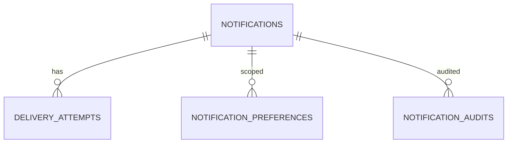

# Database — Notification Service

> Nguồn: `docs/lld/notification.md` · HLD/Penpot · Cập nhật: `2026-08-30`
> Baseline: MySQL 8.x + TypeORM `notificationdb`; Email + In-app

## 1. Quy ước chung

| Quy ước | Quyết định | Ràng buộc |
|---|---|---|
| ID | UUIDv7 string | Dedupe key/event ID unique. |
| Time | DATETIME UTC | API/event ISO-8601 UTC. |
| Source | Kafka command/event | Notification không là order/payment source. |
| Payload | Template data allowlist | Không lưu secret/OTP/password/payment credential. |
| Retention | Notification/log theo policy | Không TTL khi chưa chốt archive/compliance. |
| Observability | JSON log/W3C trace/X-Request-ID | Redact recipient/body/PII. |

## 2. Quan hệ

## 3. Chi tiết collection

### 3.1 `notifications`

| Field | Type | Ràng buộc |
|---|---|---|
| `_id` | string | UUIDv7. |
| `recipient_user_id` | string | Required Auth reference. |
| `channel` | enum | `EMAIL`, `IN_APP`. |
| `template_key`/`template_version` | string/int | Allowlist/versioned. |
| `dedupe_key` | string | Unique theo recipient/template/campaign policy. |
| `source_event_id` | string | Kafka event/command reference. |
| `data` | object | Validated allowlist, redacted fields only. |
| `status` | enum | `QUEUED`, `PROCESSING`, `SENT`, `FAILED`, `SKIPPED`, `EXPIRED`. |
| `read_status` | enum | In-app `UNREAD/READ`; null với email. |
| `scheduled_at`/`sent_at` | Date | UTC. |
| `created_at`/`updated_at` | Date | UTC. |

### 3.2 `delivery_attempts`

`_id`, `notification_id`, `attempt_no`, `provider`, `status`, `provider_message_id` masked, `error_code`, `started_at`, `finished_at`, `trace_id`, `request_id`. Không lưu rendered body/raw provider response.

### 3.3 `notification_preferences`

`_id`, `user_id`, `channel`, `category`, `status`, `updated_at`, `version`. Unique `(user_id,channel,category)`. Security-critical Auth notification có thể bypass disable theo policy.

### 3.4 `templates`, `notification_audits`, `processed_events`

- `templates`: key/version/locale/subject/body safe/status/created_at; template published immutable.
- `notification_audits`: actor/action/target/reason/metadata/occurred_at; no secret/body.
- `processed_events`: event_id/dedupe_key/processed_at/status/error; unique event ID.

## 4. Index

| Collection | Index |
|---|---|
| `notifications` | unique `(recipient_user_id,dedupe_key,channel)`; `(recipient_user_id,created_at)`; `(recipient_user_id,read_status,created_at)`; `(status,scheduled_at)` |
| `delivery_attempts` | `(notification_id,attempt_no)`; `(status,started_at)` |
| `notification_preferences` | unique `(user_id,channel,category)` |
| `templates` | unique `(key,version,locale)`; `(key,status)` |
| `processed_events` | unique `event_id`; unique `dedupe_key`; `(processed_at)` |
| `notification_audits` | `(target_id,occurred_at)`; `(actor_user_id,occurred_at)` |

## 5. Enum và rules

Channel `EMAIL/IN_APP`; status `QUEUED/PROCESSING/SENT/FAILED/SKIPPED/EXPIRED`; retry max 3; no raw secret/template body in logs/events; unread count không âm.

## 6. Migration và seed

1. Create notifications/attempts/preferences/templates/processed-events/audit collections.
2. Create unique indexes after dedupe preflight.
3. Seed order success, invoice issued, shipment delivered, auth verification templates v1 và in-app unread/read fixtures.
4. Test dedupe/retry/retention; không seed OTP/password/payment secret.

## 7. Giả định & câu hỏi mở

| # | Nội dung | Ảnh hưởng nếu sai | Cần ai xác nhận |
|---|---|---|---|
| 1 | MySQL/NestJS, Email + In-app theo lựa chọn 1C. | Ảnh hưởng schema/ops. | Tech lead |
| 2 | SMTP/Mock provider v1, exact provider/DKIM chưa chốt. | Ảnh hưởng delivery/security. | DevOps |
| 3 | Notification retention 90 ngày baseline. | Ảnh hưởng storage/privacy. | Product/Security |
| 4 | Dedupe theo recipient/template/event policy. | Ảnh hưởng email duplicate behavior. | Platform owner |
