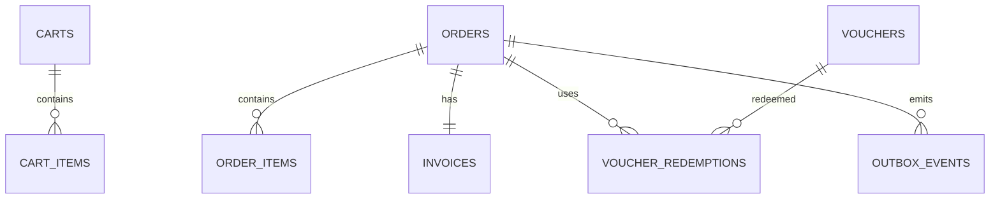

# Database — Order-Commerce Service

> Nguồn: `docs/lld/order-commerce.md` · HLD `EcommercePlatform-v4(6).excalidraw` · Cập nhật: `2026-08-30`
> Baseline: MySQL 8.4/InnoDB `orderdb` + Redis cart

## 1. Quy ước chung

| Quy ước | Quyết định | Ràng buộc |
|---|---|---|
| ID | UUIDv7 canonical string ở API, `BINARY(16)` trong MySQL | Cross-service IDs là reference, không FK. |
| Money | `BIGINT` integer VND | Không dùng FLOAT; currency bắt buộc `VND`. |
| Time | `DATETIME(6)` UTC | API/event ISO-8601 UTC. |
| Tenant | Buyer `buyer_user_id`, seller `shop_id` | Query luôn scope theo auth context. |
| Snapshot | Product title/sku/shop/price, address snapshot | Order history không phụ thuộc dữ liệu hiện tại của service khác. |
| Transaction | InnoDB transaction | Order/items/invoice/outbox/idempotency atomic trong local DB. |
| Redis | Key `cart:{user_id}`, TTL 30 ngày | Không lưu order source of truth/reservation ledger. |
| Observability | JSON log + W3C trace + X-Request-ID | Redact payment credential/raw address/token/order payload. |

## 2. Quan hệ



Cross-service Product/Inventory/Payment/Shipment/Auth chỉ dùng reference ID/API/event; không tạo FK sang database khác.

## 3. Chi tiết bảng

### 3.1 `orders`

| Cột | Type | Null | Ràng buộc |
|---|---|---:|---|
| `id` | BINARY(16) | N | PK UUIDv7. |
| `order_number` | VARCHAR(32) | N | Unique, display. |
| `checkout_group_id` | BINARY(16) | N | Liên kết orders split multi-shop. |
| `buyer_user_id` | BINARY(16) | N | Auth reference. |
| `shop_id` | BINARY(16) | N | Shop snapshot reference. |
| `status` | VARCHAR(32) | N | OrderStatus enum. |
| `subtotal/discount/shipping_fee/tax/grand_total` | BIGINT | N | `≥0`, tổng phải reconcile. |
| `payment_method/status` | VARCHAR(32) | N | VNPAY/COD + projection. |
| `address_snapshot` | JSON | N | Snapshot cần thiết; không log raw. |
| `reservation_id` | BINARY(16) | Y | Inventory reference. |
| `created_at/placed_at/updated_at` | DATETIME(6) | N | UTC. |
| `version` | BIGINT | N | Optimistic mutation. |

### 3.2 `order_items`

`id`, `order_id`, `product_id`, `sku_id`, `shop_id`, `title_snapshot`, `seller_sku_snapshot`, `unit_price`, `quantity`, `line_total`, `tax_rate_bps`, `tax_amount`, `discount_allocated`, `created_at`. `unit_price` integer VND; quantity 1–999; line_total phải bằng unit_price × quantity trong range.

| Field thuế/giảm giá | Kiểu | Ý nghĩa |
|---|---|---|
| `tax_rate_bps` | INT | Thuế suất VAT snapshot từ category của product tại lúc checkout (10% = `1000`). Bất biến sau khi đặt — đổi thuế suất danh mục không hồi tố. Xem `docs/lld/order-commerce.md` §6.4. |
| `tax_amount` | BIGINT | Phần VAT **đã nằm trong** `line_total` (giá gồm VAT), tách ra để ghi hoá đơn: `line_net × rate_bps / (10000 + rate_bps)`. Không cộng thêm vào `grand_total`. |
| `discount_allocated` | BIGINT | Tổng giảm giá (shop + platform) phân bổ về dòng này. Cần để tính `tax_amount` đúng và để hoàn tiền theo dòng khi huỷ một phần. |

### 3.3 `vouchers`, `order_vouchers` và `voucher_redemptions`

| Bảng | Field chính | Rules |
|---|---|---|
| `vouchers` | id, code, **scope**, shop_id nullable, discount_type/value, **max_discount_amount**, min_order, usage_limit, used_count, starts_at, expires_at, status, version | Code normalized unique; `PERCENT` 1–100; `FIXED`/`FREESHIP` VND range. |
| `order_vouchers` | id, order_id, voucher_id, scope, code_snapshot, discount_amount, created_at | **Bảng mới.** Một order có tối đa 3 dòng (1 mỗi `scope`). `discount_amount` là phần **đã phân bổ về đúng order con này**, không phải giá trị gốc của voucher. Unique `(order_id, scope)` — chặn cứng việc cộng dồn 2 mã cùng scope ở tầng DB. |
| `voucher_redemptions` | id, voucher_id, order_id, user_id, redeemed_at, status | Baseline unique `(voucher_id,user_id)`; atomic usage increment; policy có thể nới theo campaign sau khi chốt. |

Chi tiết field mới của `vouchers`:

| Field | Kiểu | N/Y | Ràng buộc |
|---|---|:--:|---|
| `scope` | VARCHAR(16) | N | `PLATFORM` \| `SHOP` \| `FREESHIP` (bổ sung `FREESHIP` so với v cũ). `scope` vừa xác định phạm vi áp dụng vừa là **slot cộng dồn**: tối đa 1 mã mỗi `scope` cho một lần checkout. `SHOP` bắt buộc có `shop_id`; `PLATFORM`/`FREESHIP` bắt buộc `shop_id IS NULL`. |
| `discount_type` | VARCHAR(16) | N | `PERCENT` \| `FIXED` \| `FREESHIP`. `scope=FREESHIP` chỉ nhận `discount_type` `PERCENT` hoặc `FREESHIP`; scope khác không được dùng `FREESHIP`. |
| `max_discount_amount` | BIGINT | Y | **Trần giảm giá**, chỉ có nghĩa với `PERCENT`. `NULL` = không trần. Đây là thứ hiện thực hoá "Giảm 8% tối đa 1 triệu" trên Penpot — thiếu cột này thì voucher 8% áp lên đơn 100 triệu sẽ giảm 8 triệu. |

> **Vì sao cần `order_vouchers` riêng thay vì cột `voucher_id` trên `orders`:** mô hình 3 slot cho phép một order mang nhiều voucher, và mỗi voucher góp một `discount_amount` khác nhau vào cùng order. Nhét vào một cột thì không ghi được hoá đơn chi tiết, không hoàn đúng tiền khi huỷ một phần, và không đối soát được voucher nào tốn ngân sách bao nhiêu. Cột `orders.discount` vẫn giữ, mang tổng — phải luôn bằng `SUM(order_vouchers.discount_amount)` của order đó.

### 3.4 `invoices`

`id`, `order_id` unique, `invoice_number` unique, `status` (`PENDING/ISSUED/VOIDED`), `total_amount`, `tax_breakdown` JSON, `pdf_url` nullable, `issued_at`, timestamps. Không lưu payment credential.

### 3.5 `outbox_events` và `idempotency_keys`

| Bảng | Field chính | Rules |
|---|---|---|
| `outbox_events` | event_id, aggregate_type/id, event_type, schema_version, payload JSON, occurred_at, published_at, attempt_count, last_error, dlq_at | Unique event_id; retry 3/backoff 2s; payload redacted. |
| `idempotency_keys` | key, user_id, operation, request_hash, response_snapshot JSON, status, expires_at | Key + user + operation unique; payload khác conflict; retention 24h. |

### 3.6 Redis cart

```text
cart:{buyer_user_id} → {
  status: ACTIVE,
  items: [{item_id, product_id, sku_id, shop_id, quantity, price_display_snapshot}],
  updated_at: ISO-8601 UTC
}
TTL: 30 days
```

Redis không được dùng để quyết định payment/order state hoặc stock reservation.

## 4. Index

| Bảng | Index |
|---|---|
| `orders` | unique `order_number`; `(buyer_user_id, created_at)`; `(shop_id,status,created_at)`; `checkout_group_id`; `(status,updated_at)` |
| `order_items` | `(order_id)`; `(sku_id,created_at)`; `(product_id,created_at)` |
| `vouchers` | unique normalized `code`; `(scope,status,starts_at,expires_at)`; `(shop_id,status,starts_at,expires_at)`; `(status,expires_at)` |
| `order_vouchers` | unique `(order_id,scope)`; `(voucher_id,created_at)` cho báo cáo ngân sách voucher |
| `voucher_redemptions` | unique `(voucher_id,user_id,order_id)`; `(order_id)`; `(user_id,redeemed_at)` |
| `invoices` | unique `order_id`; unique `invoice_number`; `(status,issued_at)` |
| `outbox_events` | `(published_at,occurred_at)`; `(aggregate_type,aggregate_id,occurred_at)` |
| `idempotency_keys` | PK `(key,user_id,operation)`; `expires_at` |

## 5. Enum và rules

Order transition, voucher usage, total reconciliation, one buyer/one shop scope và idempotency phải enforce ở service transaction; schema enum chỉ là lớp đầu.

## 6. Migration và seed

### 6.1 Thứ tự migration

| Thứ tự | Nội dung | Phụ thuộc |
|---:|---|---|
| 001 | Tạo database `orderdb`, charset/collation, migration metadata | — |
| 002 | Tạo `vouchers` (unique normalized `code`) | — |
| 003 | Tạo `orders` (unique `order_number`) | — |
| 004 | Tạo `order_items`, FK → `orders` | `orders` |
| 005 | Tạo `order_vouchers` (unique `(order_id,scope)`), FK → `orders`, `vouchers` | `orders`, `vouchers` |
| 006 | Tạo `voucher_redemptions` (unique `(voucher_id,user_id,order_id)`) | `vouchers`, `orders` |
| 007 | Tạo `invoices` (unique `order_id`, unique `invoice_number`) | `orders` |
| 008 | Tạo `outbox_events` | — |
| 009 | Tạo `idempotency_keys` (PK `(key,user_id,operation)`) | — |
| 010 | Thêm index `(buyer_user_id,created_at)`, `(shop_id,status,created_at)` trên `orders`; `(scope,status,starts_at,expires_at)` trên `vouchers` | Tất cả bảng trên |
| 011 | Thêm cột `tax_rate_bps`, `tax_amount`, `discount_allocated` trên `order_items` (nếu deploy tăng dần từ schema cũ) | `order_items` |
| 012 | Seed fixture cho local/test (§6.2) | Tất cả bảng trên |

Redis cart (§3.6) không có migration SQL — key theo TTL, không cần schema versioning.

### 6.2 Seed tối thiểu cho local/test

| Seed | Giá trị |
|---|---|
| `vouchers` | 1 `PLATFORM` `FIXED`; 1 `SHOP` `PERCENT` có `max_discount_amount`; 1 `FREESHIP`; 1 đã `EXPIRED`; 1 đã hết `usage_limit`. |
| `orders` | 1 mỗi `OrderStatus` (`PENDING_PAYMENT`, `CONFIRMED` cả nhánh VNPAY lẫn COD, `PROCESSING`, `SHIPPED`, `DELIVERED`, `CANCELLED`) — xem golden test `O-COD-01..10`, `O-CALC-01..15` ở `docs/test/order-commerce.md`. |
| `order_items` | Có `tax_rate_bps` khác nhau (10%, 5%, 0%) trên cùng 1 order — test tách thuế theo dòng. |
| `order_vouchers` | Order mẫu có đủ 3 dòng (`PLATFORM`+`SHOP`+`FREESHIP`) khớp ví dụ golden ở §3.2a LLD. |
| `invoices` | 1 `PENDING`; 1 `ISSUED` có `pdf_url`. |
| `idempotency_keys` | 1 key đã dùng cho `POST /checkout`, còn hạn 24h. |

Không seed payment credential/address thật — dùng snapshot giả lập; không hard-delete order history trong seed/rollback script.

### 6.3 Kiểm tra bắt buộc trước khi chạy migration production

1. Reconcile: mọi `order.grand_total` phải khớp công thức §3.2a (LLD) trên dữ liệu hiện có trước khi thêm CHECK constraint `grand_total >= 0`.
2. Verify `Σ order_vouchers.discount_amount = orders.discount` cho mọi order — bất biến bắt buộc từ §3.2a.
3. Orphan detection: `order_items`/`invoices` không có `order_id` mồ côi trước khi thêm FK.

## 7. Giả định & câu hỏi mở

| # | Nội dung | Ảnh hưởng nếu sai | Cần ai xác nhận |
|---|---|---|---|
| 1 | MySQL 8.4/InnoDB được chọn để giải quyết mâu thuẫn MySQL/PostgreSQL trong HLD. | Ảnh hưởng SQL/migration/lock. | Architecture/Tech lead |
| 2 | Cart Redis TTL 30 ngày, không durable order state. | Ảnh hưởng cart recovery/cross-device. | Product owner |
| 3 | Address snapshot lưu JSON trong order; Auth User vẫn source address. | Ảnh hưởng privacy/schema/report. | Security/Order owner |
| 4 | ~~Chưa có stacking policy~~ → **Đã chốt**: mô hình 3 slot (`PLATFORM` + `SHOP`/shop + `FREESHIP`), tối đa 1 mã mỗi `scope`, thứ tự áp dụng và phân bổ ở `docs/lld/order-commerce.md` §3.2a. Bảng `vouchers` **không có** cột audience/segment trong v1 (voucher chỉ theo mã); các màn Penpot Seller voucher targeting ngoài v1. | Nếu bật targeting cần bảng `voucher_audiences` mới. | Đã đóng |
| 5 | Invoice PDF generation/storage provider chưa chốt. | Ảnh hưởng `pdf_url`, async state và retention. | Finance/DevOps |
