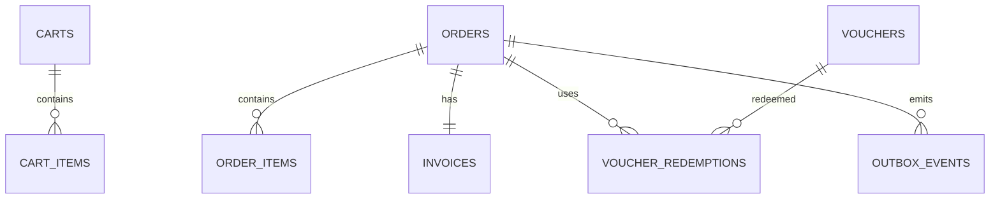

# Database — Order-Commerce Service

> Nguồn: `docs/lld/order-commerce.md` · HLD `EcommercePlatform-v4(6).excalidraw` · Cập nhật: `2026-08-30`
> Baseline: MySQL 8.4/InnoDB `orderdb` + Redis cart

## 1. Quy ước chung

| Quy ước | Quyết định | Ràng buộc |
|---|---|---|
| ID | UUIDv7 canonical string ở API, `BINARY(16)` trong MySQL | Cross-service IDs là reference, không FK. |
| Money | `BIGINT` integer VND | Không dùng FLOAT; currency bắt buộc `VND`. |
| Time | `DATETIME(6)` UTC | API/event ISO-8601 UTC. |
| Tenant | Buyer `buyer_user_id`, seller `shop_id` | Query luôn scope theo auth context. |
| Snapshot | Product title/sku/shop/price, address snapshot | Order history không phụ thuộc dữ liệu hiện tại của service khác. |
| Transaction | InnoDB transaction | Order/items/invoice/outbox/idempotency atomic trong local DB. |
| Redis | Key `cart:{user_id}`, TTL 30 ngày | Không lưu order source of truth/reservation ledger. |
| Observability | JSON log + W3C trace + X-Request-ID | Redact payment credential/raw address/token/order payload. |

## 2. Quan hệ



Cross-service Product/Inventory/Payment/Shipment/Auth chỉ dùng reference ID/API/event; không tạo FK sang database khác.

## 3. Chi tiết bảng

### 3.1 `orders`

| Cột | Type | Null | Ràng buộc |
|---|---|---:|---|
| `id` | BINARY(16) | N | PK UUIDv7. |
| `order_number` | VARCHAR(32) | N | Unique, display. |
| `checkout_group_id` | BINARY(16) | N | Liên kết orders split multi-shop. |
| `buyer_user_id` | BINARY(16) | N | Auth reference. |
| `shop_id` | BINARY(16) | N | Shop snapshot reference. |
| `status` | VARCHAR(32) | N | OrderStatus enum. |
| `subtotal/discount/shipping_fee/tax/grand_total` | BIGINT | N | `≥0`, tổng phải reconcile. |
| `payment_method/status` | VARCHAR(32) | N | VNPAY/COD + projection. |
| `address_snapshot` | JSON | N | Snapshot cần thiết; không log raw. |
| `reservation_id` | BINARY(16) | Y | Inventory reference. |
| `created_at/placed_at/updated_at` | DATETIME(6) | N | UTC. |
| `version` | BIGINT | N | Optimistic mutation. |

### 3.2 `order_items`

`id`, `order_id`, `product_id`, `sku_id`, `shop_id`, `title_snapshot`, `seller_sku_snapshot`, `unit_price`, `quantity`, `line_total`, `created_at`. `unit_price` integer VND; quantity 1–999; line_total phải bằng unit_price × quantity trong range.

### 3.3 `vouchers` và `voucher_redemptions`

| Bảng | Field chính | Rules |
|---|---|---|
| `vouchers` | id, code, scope, shop_id nullable, discount_type/value, min_order, usage_limit, used_count, starts_at, expires_at, status, version | Code normalized unique; `PERCENT` 1–100; fixed VND range; platform/shop scope. |
| `voucher_redemptions` | id, voucher_id, order_id, user_id, redeemed_at, status | Baseline unique `(voucher_id,user_id)`; atomic usage increment; policy có thể nới theo campaign sau khi chốt. |

### 3.4 `invoices`

`id`, `order_id` unique, `invoice_number` unique, `status` (`PENDING/ISSUED/VOIDED`), `total_amount`, `tax_breakdown` JSON, `pdf_url` nullable, `issued_at`, timestamps. Không lưu payment credential.

### 3.5 `outbox_events` và `idempotency_keys`

| Bảng | Field chính | Rules |
|---|---|---|
| `outbox_events` | event_id, aggregate_type/id, event_type, schema_version, payload JSON, occurred_at, published_at, attempt_count, last_error, dlq_at | Unique event_id; retry 3/backoff 2s; payload redacted. |
| `idempotency_keys` | key, user_id, operation, request_hash, response_snapshot JSON, status, expires_at | Key + user + operation unique; payload khác conflict; retention 24h. |

### 3.6 Redis cart

```text
cart:{buyer_user_id} → {
  status: ACTIVE,
  items: [{item_id, product_id, sku_id, shop_id, quantity, price_display_snapshot}],
  updated_at: ISO-8601 UTC
}
TTL: 30 days
```

Redis không được dùng để quyết định payment/order state hoặc stock reservation.

## 4. Index

| Bảng | Index |
|---|---|
| `orders` | unique `order_number`; `(buyer_user_id, created_at)`; `(shop_id,status,created_at)`; `checkout_group_id`; `(status,updated_at)` |
| `order_items` | `(order_id)`; `(sku_id,created_at)`; `(product_id,created_at)` |
| `vouchers` | unique normalized `code`; `(shop_id,status,starts_at,expires_at)`; `(status,expires_at)` |
| `voucher_redemptions` | unique `(voucher_id,user_id,order_id)`; `(order_id)`; `(user_id,redeemed_at)` |
| `invoices` | unique `order_id`; unique `invoice_number`; `(status,issued_at)` |
| `outbox_events` | `(published_at,occurred_at)`; `(aggregate_type,aggregate_id,occurred_at)` |
| `idempotency_keys` | PK `(key,user_id,operation)`; `expires_at` |

## 5. Enum và rules

Order transition, voucher usage, total reconciliation, one buyer/one shop scope và idempotency phải enforce ở service transaction; schema enum chỉ là lớp đầu.

## 6. Migration và seed

1. Tạo tables, enum/check constraints, FK nội bộ (`order_items.order_id`, `invoices.order_id`).
2. Tạo unique/index sau duplicate preflight.
3. Seed voucher platform/shop, cart fixture, order mỗi state, invoice pending/issued.
4. Verify money reconciliation, orphan detection, outbox/idempotency cleanup.
5. Không seed payment credential/address thật; không hard-delete order history.

## 7. Giả định & câu hỏi mở

| # | Nội dung | Ảnh hưởng nếu sai | Cần ai xác nhận |
|---|---|---|---|
| 1 | MySQL 8.4/InnoDB được chọn để giải quyết mâu thuẫn MySQL/PostgreSQL trong HLD. | Ảnh hưởng SQL/migration/lock. | Architecture/Tech lead |
| 2 | Cart Redis TTL 30 ngày, không durable order state. | Ảnh hưởng cart recovery/cross-device. | Product owner |
| 3 | Address snapshot lưu JSON trong order; Auth User vẫn source address. | Ảnh hưởng privacy/schema/report. | Security/Order owner |
| 4 | Voucher platform/shop, chưa có stacking priority/combination policy. Bảng `vouchers` **không có** cột audience/segment trong v1 (voucher chỉ theo mã); các màn Penpot Seller voucher targeting ngoài v1. Platform voucher tạo qua `/admin/vouchers`. | Ảnh hưởng checkout total và redemption; nếu bật targeting cần bảng `voucher_audiences` mới. | Product/Finance |
| 5 | Invoice PDF generation/storage provider chưa chốt. | Ảnh hưởng `pdf_url`, async state và retention. | Finance/DevOps |
