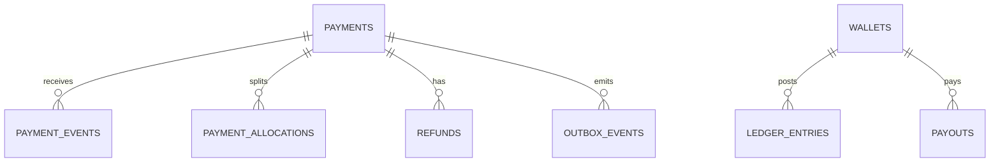

# Database — Payment-Wallet Service

> Nguồn: `docs/lld/payment-wallet.md` · HLD/Penpot · Cập nhật: `2026-08-30`
> Baseline: MySQL 8.4/InnoDB `paymentdb`; UUIDv7 API → `BINARY(16)` storage

## 1. Quy ước chung

| Quy ước | Quyết định | Ràng buộc |
|---|---|---|
| Money | `BIGINT` integer VND | Không FLOAT; amount `1..999999999999`. |
| Time | `DATETIME(6)` UTC | API/event ISO-8601. |
| Ledger | Double-entry append-only | Tổng debit=credit mỗi posting batch. |
| Idempotency | Request hash + provider event ID | Webhook/payout/refund không double post. |
| Secret | Secret manager/environment | Không lưu/log VNPAY secret/signature raw. |
| Cross-service | Order/shop/user IDs là references | Không FK sang Order/Auth/Shipment. |
| Observability | JSON log/W3C trace/X-Request-ID | Redact payment/bank/PII. |

## 2. Quan hệ

## 3. Chi tiết bảng

### 3.1 `payments`

`id`, `order_id`, `checkout_group_id`, `buyer_user_id`, `method`, `provider`, `amount`, `currency`, `status`, `provider_transaction_ref`, `expires_at`, `paid_at`, `version`, timestamps. `order_id` có thể reference order con; amount snapshot immutable sau create.

### 3.2 `payment_allocations`

`id`, `payment_id`, `order_id`, `shop_id`, `gross_amount`, `commission_amount`, `tax_amount`, `seller_net_amount`, `currency`, `created_at`. Invariant: gross = commission + tax + net theo rounding policy.

### 3.3 `payment_events`

`id`, `payment_id`, `provider`, `provider_event_id` unique, `provider_status`, `amount`, `payload_hash`, `received_at`, `applied_at`, `status`, `failure_code`. Không lưu raw callback nếu policy không yêu cầu; nếu cần audit phải encrypt/redact.

### 3.4 `wallets`, `ledger_entries`

| Bảng | Field/rule |
|---|---|
| `wallets` | `id`, `shop_id` unique, `available_balance`, `pending_balance`, `currency`, `status`, `version`, timestamps; balance non-negative. |
| `ledger_entries` | `id`, `posting_id`, `wallet_id`, `entry_type(DEBIT/CREDIT)`, `amount`, `balance_after`, `reference_type/id`, `created_at`; immutable. |

Mỗi posting có clearing/platform/tax/seller accounts logic; không update balance nếu chưa append ledger entries trong cùng transaction.

### 3.5 `payouts` và `refunds`

| Bảng | Field/rule |
|---|---|
| `payouts` | id, wallet_id, shop_id, amount, status, bank_account_snapshot encrypted/masked, provider_ref, idempotency_key, requested_at, completed_at. |
| `refunds` | id, payment_id, order_id, amount, reason, status, provider_ref, idempotency_key, created_at/updated_at. |

### 3.6 `outbox_events`, `idempotency_keys`, `audit_logs`

Transactional outbox giữ envelope/payload redacted; idempotency giữ request hash/response snapshot 24h; audit giữ actor/action/target/reason, không secret/payment credential.

### 3.7 `fee_configs`, `tax_configs` (admin finance — effective-dated)

| Bảng | Field/rule |
|---|---|
| `fee_configs` | `id`, `scope(PLATFORM/CATEGORY)`, `category_id` (reference, no-FK; null khi `PLATFORM`), `rate_bps` (int, basis points), `effective_from`, `note`, `created_by`, `created_at`. **Append-only**: không UPDATE/DELETE; version áp dụng = bản `effective_from` ≤ allocation time lớn nhất. |
| `tax_configs` | `id`, `scope`, `category_id?`, `rate_bps`, `effective_from`, `note`, `created_by`, `created_at`. Quy tắc như `fee_configs`. |

`AllocationService` snapshot `fee_configs.id`/`tax_configs.id` đã dùng vào `payment_allocations` (thêm cột `fee_config_id`, `tax_config_id` reference) để audit; đổi config không hồi tố allocation đã ghi.

### 3.8 `settlement_batches`, `settlement_batch_items` (admin settlement)

| Bảng | Field/rule |
|---|---|
| `settlement_batches` | `id`, `period_start`, `period_end`, `status(PENDING/PROCESSING/COMPLETED/FAILED)`, `shop_count`, `total_gross`, `total_commission`, `total_tax`, `total_net`, `total_released`, `total_held`, `created_at`, `closed_at`, `last_error`. |
| `settlement_batch_items` | `id`, `batch_id` FK, `shop_id` (reference), `wallet_id` FK, `gross`, `commission`, `tax`, `net`, `released_amount`, `held_amount`, `status`, `posting_id` (link tới ledger release posting), `created_at`. Mỗi item release chỉ tạo ledger posting cân bằng đã định nghĩa; không tạo entry tự do. |

Batch là read + ops (`retry` khi `FAILED`); hold/release theo rủi ro thuộc service `dispute` (v1.1).

## 4. Index

| Bảng | Index |
|---|---|
| `payments` | unique `order_id`/payment intent policy; `(buyer_user_id,created_at)`; `(status,expires_at)`; provider ref |
| `payment_events` | unique `(provider,provider_event_id)`; `(payment_id,received_at)` |
| `payment_allocations` | `(payment_id)`; `(shop_id,created_at)` |
| `wallets` | unique `shop_id`; `(status,updated_at)` |
| `ledger_entries` | `(wallet_id,created_at)`; unique `(posting_id,entry_type,wallet_id)`; `(reference_type,reference_id)` |
| `payouts` | unique idempotency key; `(shop_id,status,created_at)`; provider ref |
| `refunds` | unique idempotency key; `(payment_id,created_at)` |
| `outbox_events` | `(published_at,occurred_at)`; `(aggregate_type,aggregate_id,occurred_at)` |
| `audit_logs` | `(target_type,target_id,occurred_at)`; `(actor_user_id,occurred_at)` |
| `fee_configs` / `tax_configs` | `(scope,category_id,effective_from)`; không unique để cho phép nhiều version |
| `settlement_batches` | `(status,period_start)`; unique `(period_start,period_end)` |
| `settlement_batch_items` | `(batch_id)`; `(shop_id,created_at)`; unique `(batch_id,shop_id)` |

## 5. Enum và rules

`PaymentStatus`: `PENDING/SUCCESS/FAILED/EXPIRED/REFUNDED/PARTIALLY_REFUNDED`; `WalletStatus`: `ACTIVE/FROZEN/CLOSED`; `PayoutStatus`: `REQUESTED/PROCESSING/SUCCESS/FAILED/CANCELLED`; `RefundStatus`: `REQUESTED/PROCESSING/SUCCESS/FAILED/CANCELLED`; `SettlementBatchStatus`: `PENDING/PROCESSING/COMPLETED/FAILED`; `FeeTaxScope`: `PLATFORM/CATEGORY`.

DB check không âm, application state machine/amount-match/signature/KYC gate; không hard-delete payment/ledger/provider event.

## 6. Migration và seed

### 6.1 Thứ tự migration

| Thứ tự | Nội dung | Phụ thuộc |
|---:|---|---|
| 001 | Tạo database `paymentdb`, charset/collation, migration metadata | — |
| 002 | Tạo `payments` (unique `order_id`/intent policy) | — |
| 003 | Tạo `payment_events` (unique `(provider,provider_event_id)`) | `payments` |
| 004 | Tạo `wallets` (unique `shop_id`) | — |
| 005 | Tạo `payment_allocations`, FK → `payments`, `wallets` | `payments`, `wallets` |
| 006 | Tạo `ledger_entries` (unique `(posting_id,entry_type,wallet_id)`), FK → `wallets` | `wallets` |
| 007 | Tạo `payouts`, `refunds` | `wallets`, `payments` |
| 008 | Tạo `outbox_events`, `idempotency_keys`, `audit_logs` | — |
| 009 | Tạo `fee_configs`, `tax_configs` (effective-dated, append-only, không unique để cho nhiều version) | — |
| 010 | Thêm cột `fee_config_id`, `tax_config_id` trên `payment_allocations`, FK → `fee_configs`/`tax_configs` | `payment_allocations`, `fee_configs`, `tax_configs` |
| 011 | Tạo `settlement_batches` (unique `(period_start,period_end)`), `settlement_batch_items` (unique `(batch_id,shop_id)`) | `wallets` |
| 012 | Thêm index `(buyer_user_id,created_at)`, `(status,expires_at)` trên `payments`; `(shop_id,created_at)` trên `payment_allocations` | Tất cả bảng trên |
| 013 | Seed fixture cho local/test (§6.2) | Tất cả bảng trên |

### 6.2 Seed tối thiểu cho local/test

| Seed | Giá trị |
|---|---|
| `payments` | 1 VNPAY `PENDING`; 1 VNPAY `SUCCESS`; 1 VNPAY `FAILED`; 1 COD `PENDING_COD`; 1 COD `SUCCESS` (đã capture sau delivered). |
| `payment_events` | Webhook event khớp mỗi payment `SUCCESS`/`FAILED` ở trên — test idempotent replay. |
| `wallets` + `ledger_entries` | 1 wallet có `available_balance`/`pending_balance` khớp **chính xác** tổng `ledger_entries` (double-entry cân bằng — đây là bất biến bắt buộc, seed sai sẽ làm mọi test reconciliation fail). |
| `payouts` | 1 `REQUESTED`; 1 `SUCCESS`; 1 `FAILED`. |
| `refunds` | 1 `SUCCESS` không vượt `payments.amount` đã capture. |
| `fee_configs`/`tax_configs` | 1 version `PLATFORM` fee + 1 version tax do Finance cung cấp (placeholder nếu chưa có số thật — xem `System_Overview.md` §11 blocker #5), `effective_from` trong quá khứ để allocation seed dùng được ngay. |
| `settlement_batches` | 1 batch `COMPLETED` với `settlement_batch_items` khớp tổng `payment_allocations` của batch đó. |

Không seed VNPAY secret/signature thật hoặc bank account thật — dùng sandbox/mock credential.

### 6.3 Kiểm tra bắt buộc trước khi chạy migration production

1. **Double-entry cân bằng**: mọi `posting_id` phải có tổng debit = tổng credit trước khi enable ledger cho traffic thật — migration phải fail nếu phát hiện lệch.
2. Reconcile `wallets.available_balance + pending_balance` khớp `Σ ledger_entries` cho từng `wallet_id`.
3. Verify `payment_allocations.fee_config_id`/`tax_config_id` trỏ đúng version **có hiệu lực tại `payments.created_at`**, không phải version mới nhất.

## 7. Giả định & câu hỏi mở

| # | Nội dung | Ảnh hưởng nếu sai | Cần ai xác nhận |
|---|---|---|---|
| 1 | MySQL 8.4/InnoDB và double-entry ledger là baseline. | Ảnh hưởng transaction/settlement. | Finance/Tech lead |
| 2 | VNPAY sandbox v1; callback raw payload có thể chỉ lưu hash. | Ảnh hưởng dispute/reconciliation evidence. | Finance/Security |
| 3 | One payment intent/order policy chưa chốt cho multi-shop group. | Ảnh hưởng allocation/refund/payment API. | Order owner |
| 4 | Commission/tax rates và rounding chưa chốt; `fee_configs`/`tax_configs` lưu version effective-dated, giá trị khởi tạo do Finance seed. Admin sửa qua `PUT /admin/fees`,`/admin/taxes` (append version, không hồi tố). | Ảnh hưởng ledger/invoice. | Finance |
| 5 | Bank payout adapter chưa có provider/SLA. | Cần mock/reconciliation job. | Finance/DevOps |
| 6 | Cơ chế sinh `settlement_batches` (scheduled theo cửa sổ hoàn tiền vs event) chưa chốt; bảng chỉ mô tả cấu trúc kết quả. Không có microservice admin riêng — bảng thuộc `payment-wallet` (`System_Overview.md` §6.3). | Ảnh hưởng thời điểm `pending → available`. | Finance + Order owner |
