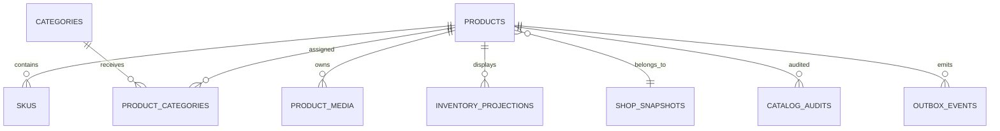

# Database — Product Catalog Service

> Nguồn: `docs/lld/product-catalog.md` (đối chiếu với HLD `EcommercePlatform-v4(6).excalidraw` và Penpot `New File 1.penpot.zip`) · Cập nhật: `2026-09-17`
> Baseline: MongoDB 8.x + Mongoose · database riêng `product_catalog`

## 1. Quy ước chung

| Quy ước | Quyết định | Ràng buộc |
|---|---|---|
| ID | UUIDv7 dạng string lowercase cho document domain; `sku_id`, `shop_id`, `user_id` là reference ID dạng string | Không dùng MongoDB `_id` để làm cross-service ID; API luôn trả field ID rõ ràng. |
| Timestamp | BSON `Date`, UTC | API/log serialize ISO-8601 UTC; không lưu local time. |
| Tiền | `Long` integer VND | Không dùng floating point/Decimal128 cho giá baseline; `1 ≤ price ≤ 999999999999`. |
| Version | `version: Long`, bắt đầu từ `1` | Mutation phải kiểm tra version; mismatch trả `PRODUCT_VERSION_CONFLICT`. |
| Soft delete | Lifecycle `ARCHIVED` (không hard-delete; `DELETED` không dùng trong v1) | Không hard-delete product, SKU, media hoặc category có reference nghiệp vụ trong v1. |
| Cross-service reference | Chỉ lưu ID + source metadata | Không tạo foreign key hoặc query trực tiếp database của Auth User/Inventory/Search/Order. |
| Tenant scope | `shop_id` trên product và các read model liên quan | Seller query/mutation luôn filter theo shop scope lấy từ auth context. |
| Transaction | MongoDB transaction trên replica set/sharded deployment | Mutation domain + outbox + audit phải commit cùng transaction khi có thể. |
| Schema validation | Mongoose schema + application policy + migration validator | Không coi Mongoose là thay thế cho authorization/state policy. |
| Sensitive data | Không lưu KYC document, access token hay media bytes | Chỉ lưu allowlist shop/KYC projection và object key/checksum media. |

### 1.1 Định dạng document chung

```json
{
  "_id": "01912f31-7a1b-7c12-9c55-8b1c34a6d921",
  "created_at": "2026-08-30T09:00:00.000Z",
  "updated_at": "2026-08-30T09:00:00.000Z",
  "version": 1
}
```

`created_at`, `updated_at`, `version` là field bắt buộc với aggregate/read model có mutation. Event projection thêm `source_version` và `source_event_id` để chống event cũ/out-of-order.

## 2. Quan hệ dữ liệu



Đây là quan hệ logic giữa MongoDB collections; không phải relational FK. `shop_snapshots` đến từ Auth User, `inventory_projections` đến từ Inventory, còn `products`, `skus`, taxonomy và media metadata thuộc Product Catalog.

## 3. Chi tiết collection

### 3.1 `products`

Document mẫu rút gọn:

```json
{
  "_id": "product-01912f31",
  "shop_id": "shop-01912f30",
  "slug": "ao-khoac-cotton",
  "title": "Áo khoác cotton",
  "description": "Mô tả đã sanitize theo allowlist.",
  "brand": "Taca Brand",
  "status": "DRAFT",
  "price_summary": {
    "base_price": 299000,
    "sale_price": 249000,
    "currency": "VND"
  },
  "primary_category_id": "category-01912f20",
  "shop_snapshot": {
    "shop_id": "shop-01912f30",
    "name": "Taca Shop",
    "slug": "taca-shop",
    "logo_url": "https://cdn.example/logo.webp",
    "shop_status": "ACTIVE",
    "kyc_status": "APPROVED",
    "source_version": 8,
    "updated_at": "2026-08-30T08:59:00.000Z"
  },
  "rating_summary": {
    "avg": null,
    "count": 0,
    "updated_at": null
  },
  "published_at": null,
  "unpublished_at": null,
  "archived_at": null,
  "blocked_at": null,
  "block_reason": null,
  "created_at": "2026-08-30T09:00:00.000Z",
  "updated_at": "2026-08-30T09:00:00.000Z",
  "version": 1
}
```

| Field | Type | Required | Ràng buộc |
|---|---|---:|---|
| `_id` | string UUIDv7 | Có | Immutable. |
| `shop_id` | string | Có | Immutable sau create; lấy từ actor scope, không tin body. |
| `slug` | string | Có | lowercase, hyphen, tối đa 160 ký tự; unique trong shop. |
| `title` | string | Có | Trim; tối đa 200 Unicode characters. |
| `description` | string | Có khi publish | Tối đa 100.000 ký tự; sanitize rich text/HTML allowlist. |
| `brand` | string/null | Không | Tối đa 120 Unicode characters. |
| `status` | enum | Có | `DRAFT`, `ACTIVE`, `INACTIVE`, `BLOCKED`, `ARCHIVED`. |
| `price_summary` | object | Có khi publish | Integer VND; thể hiện giá đại diện/min price của SPU (tính từ SKU set); giá SKU là nguồn kiểm tra cuối khi checkout. Khi tạo product chưa có SKU, seller nhập `price_summary` làm giá khởi tạo; ngay khi SKU set không rỗng, `price_summary` được application service **tự tính lại** (`base` = min `base_price` của SKU `ACTIVE`, `sale` = min `sale_price` tương ứng) mỗi lần `PUT /seller/products/{productId}/skus`. |
| `primary_category_id` | string/null | Có khi publish | Category phải `ACTIVE`. |
| `shop_snapshot` | object | Có | Projection allowlist từ Auth User; không phải source of truth KYC. |
| `rating_summary` | object/null | Không | `{avg: double\|null, count: long, updated_at: Date\|null}` — cache từ event `rating.aggregate.updated` (`rating.events.v1`, sở hữu bởi `rating-comment`); chỉ display, không phải source of truth rating. |
| `version` | long | Có | Atomic compare-and-set. |

Không nhúng `available_qty`, `reserved_qty` vào product aggregate. Stock display đi qua `inventory_projections` để tránh nhầm Product là inventory ledger.

### 3.2 `skus`

Tách collection để giới hạn kích thước product document và hỗ trợ update SKU độc lập.

| Field | Type | Required | Ràng buộc |
|---|---|---:|---|
| `_id` | string UUIDv7 | Có | API gọi là `sku_id`. |
| `product_id` | string | Có | Logical reference tới `products`. |
| `shop_id` | string | Có | Denormalized tenant filter; phải khớp product. |
| `seller_sku` | string | Có | Unique trong shop, trim/normalize. |
| `attributes` | object map | Có | Tối đa 50 key; type theo definitions. |
| `variant_key` | string | Có | Canonical từ variant dimensions; unique trong product. |
| `price_override` | long/null | Không | Integer VND trong range; **chỉ override `sale_price`** của SKU so với `products.price_summary.base_price`/`sale_price` — `base_price` luôn kế thừa từ product, không có field override riêng cho base. |
| `status` | enum | Có | `DRAFT`, `ACTIVE`, `INACTIVE`, `ARCHIVED`. |
| `media_ids` | string[] | Không | Chỉ tham chiếu `product_media` cùng product. |
| `version` | long | Có | Atomic compare-and-set. |

`attributes` không được hard-code `color`/`size`. `variant_key` phải được tạo lại ở server, không tin chuỗi client gửi.

`skus[].price` trả về ở API đọc (`docs/api/product-catalog.md` §3.1/§3.2) là giá **đã resolve**: `base_price = products.price_summary.base_price`, `sale_price = price_override ?? products.price_summary.sale_price`. Đây khác với field lưu trữ thô `price_override` ở trên — client không được tự suy `base_price` từ `price_override`.

### 3.3 `attribute_definitions`

| Field | Type | Required | Ràng buộc |
|---|---|---:|---|
| `_id` | string UUIDv7 | Có | — |
| `scope_type` | enum | Có | `PRODUCT` hoặc `CATEGORY`. |
| `scope_id` | string | Có | Product/category ID tương ứng. |
| `key` | string | Có | `[a-z0-9_]+`, tối đa 64, unique trong scope. |
| `label` | string | Có | Tối đa 120 Unicode characters. |
| `type` | enum | Có | `STRING`, `NUMBER`, `BOOLEAN`, `ENUM`. |
| `is_variant_dimension` | boolean | Có | Tối đa 10 dimension/product. |
| `allowed_values` | string[] | Có với ENUM | Tối đa 200 giá trị, unique. |
| `unit` | string/null | Không | Hiển thị; không tự đổi precision. |
| `display_as` | enum | Không | `PLAIN` (default), `COLOR_SWATCH`, `IMAGE_THUMB`. Chỉ hint render editor/PDP; không đổi `variant_key`. |
| `value_meta` | object/null | Không | Map `value → {swatch_hex?, swatch_media_id?}` cho `COLOR_SWATCH`/`IMAGE_THUMB`. Optional; không validate bắt buộc. |
| `sort_order` | int | Có | Dùng cho editor/detail display. |
| `status` | enum | Có | `ACTIVE`, `INACTIVE`, `ARCHIVED`. |

Giới hạn product: tối đa 50 definitions. Category definition khi áp dụng vào product phải được materialize/validate tại application layer để đảm bảo schema của SKU không trôi.

### 3.4 `categories`

| Field | Type | Required | Ràng buộc |
|---|---|---:|---|
| `_id` | string UUIDv7 | Có | — |
| `parent_id` | string/null | Có | Null với root; không được tạo cycle. |
| `name` | string | Có | Tối đa 120; unique theo cùng parent. |
| `slug` | string | Có | lowercase; unique toàn taxonomy baseline. |
| `path` | string | Có | Materialized path theo ID bất biến, ví dụ `/01912f20-7a1b-7c12-9c55-8b1c34a6d921/01912f21-7a1b-7c12-9c55-8b1c34a6d921`. |
| `depth` | int | Có | Root depth 1; tối đa 5. |
| `status` | enum | Có | `ACTIVE`, `INACTIVE`, `ARCHIVED`. |
| `sort_order` | int | Có | Không âm. |
| `tax_rate_bps` | int/null | Y* | **Thuế suất VAT của danh mục**, đơn vị *basis point* (1% = 100 bps). VD 10% = `1000`, 5% = `500`, 0% = `0`. Khoảng hợp lệ 0–10000. `null` = thừa kế từ `parent_id`. *`Y*`: nullable cho category con, **bắt buộc non-null cho category root** (`parent_id IS NULL`) — validate ở application layer vì MongoDB schema validator không dễ diễn đạt ràng buộc điều kiện chéo trường (conditional cross-field constraint) như CHECK constraint của RDBMS. |
| `version` | long | Có | Atomic update. |

Category inactive/archived không nhận assignment mới. Không hard-delete category đã có product reference.

**Vì sao `tax_rate_bps` là số nguyên bps chứ không phải decimal:** toàn hệ thống cấm float ở mọi tầng (`System_Overview.md` §10). Lưu `0.1` dạng double rồi nhân với tiền là con đường chắc chắn dẫn tới lệch đồng. Với bps, phép tính thuế là số nguyên trọn vẹn: `tax = line_net × rate_bps / (10000 + rate_bps)`.

Thuế suất **thừa kế theo cây danh mục**: sản phẩm lấy `tax_rate_bps` của `primary_category_id`; nếu category đó có giá trị `null` thì leo lên `parent_id` cho tới khi gặp giá trị. Root bắt buộc có giá trị để không bao giờ rỗng. Order-Commerce **snapshot** thuế suất tại thời điểm checkout — đổi thuế suất sau này không hồi tố đơn cũ.

### 3.5 `product_categories`

| Field | Type | Required | Ràng buộc |
|---|---|---:|---|
| `_id` | string UUIDv7 | Có | — |
| `product_id` | string | Có | — |
| `category_id` | string | Có | Category logic reference. |
| `is_primary` | boolean | Có | Mỗi product tối đa đúng 1 primary khi publish. |
| `assigned_at` | Date | Có | UTC. |
| `assigned_by` | string | Có | Actor user ID. |

Tổng số assignment tối đa 3/product: 1 primary + 2 secondary. Replace assignment phải atomic trong transaction.

### 3.6 `product_media`

| Field | Type | Required | Ràng buộc |
|---|---|---:|---|
| `_id` | string UUIDv7 | Có | API gọi là `media_id`. |
| `product_id` | string | Có | — |
| `sku_id` | string/null | Không | Nếu gắn SKU phải cùng product. |
| `scope` | enum | Có | `SPU` hoặc `SKU`. |
| `object_key` | string | Có | Private S3/MinIO key do server sinh. |
| `content_type` | string | Có | Image: JPG/PNG/WebP; video: MP4 baseline. |
| `size_bytes` | long | Có | Image ≤20 MiB; video ≤200 MiB. |
| `sha256` | string | Có | Hex checksum sau complete. |
| `sort_order` | int | Có | Không âm. |
| `is_cover` | boolean | Có | Tối đa 1 cover READY/product. |
| `status` | enum | Có | `UPLOADING`, `SCANNING`, `READY`, `REJECTED`, `DELETED`. |
| `uploaded_by` | string | Có | Actor user ID. |
| `created_at`/`updated_at` | Date | Có | UTC. |

Quota baseline: tối đa 12 ảnh + 3 video/product. `READY` cover là điều kiện publish; media bytes không lưu trong MongoDB.

### 3.7 `shop_snapshots`

| Field | Type | Required | Ràng buộc |
|---|---|---:|---|
| `_id` | string | Có | Dùng `shop_id` làm document ID. |
| `shop_id` | string | Có | Auth User reference. |
| `name` | string | Có | Display snapshot. |
| `slug` | string | Có | Display/routing snapshot. |
| `logo_url` | string/null | Không | URL hiển thị đã allowlist. |
| `shop_status` | string | Có | Auth contract projection, tối thiểu `ACTIVE`/`SUSPENDED`. |
| `kyc_status` | string | Có | Auth contract projection, tối thiểu `PENDING`/`APPROVED`/`NEEDS_INFO`/`REJECTED`/`EXPIRED`. |
| `source_version` | long | Có | Bỏ qua event cũ hơn. |
| `source_event_id` | string | Có | Dedupe. |
| `updated_at` | Date | Có | Thời điểm source event. |

Product chỉ dùng snapshot cho display/gate nhanh. Auth User là source of truth và không bị ghi ngược từ Product.

### 3.8 `inventory_projections`

| Field | Type | Required | Ràng buộc |
|---|---|---:|---|
| `_id` | string | Có | Dùng `sku_id` làm document ID. |
| `sku_id` | string | Có | Inventory reference. |
| `product_id` | string | Có | Catalog reference. |
| `available_qty_snapshot` | long | Có | Integer `≥0`, chỉ đọc từ Inventory event. |
| `reserved_qty_snapshot` | long | Không | Display/diagnostic, không dùng để deduct. |
| `committed_qty_snapshot` | long | Không | Display/diagnostic. |
| `stock_status` | enum | Có | `UNKNOWN`, `IN_STOCK`, `LOW_STOCK`, `OUT_OF_STOCK`, `STALE`. |
| `as_of` | Date | Có | Source snapshot time. |
| `source_version` | long | Có | Monotonic per SKU. |
| `source_event_id` | string | Có | Dedupe/replay. |
| `updated_at` | Date | Có | Consumer processing time. |

Projection stale sau 60 giây. Product không thực hiện reserve/deduct và không coi projection là availability guarantee.

### 3.9 `outbox_events`

| Field | Type | Required | Ràng buộc |
|---|---|---:|---|
| `_id` | string UUIDv7 | Có | Document ID, immutable. |
| `event_id` | string UUIDv7 | Có | ID event duy nhất toàn service — field riêng bắt buộc (connector map `collection.field.event.id=event_id`, xem `docs/lld/product-catalog.md` §6.6); không bỏ field này dù giá trị có trùng `_id`. |
| `aggregate_type` | enum | Có | `PRODUCT`, `SKU`, `CATEGORY`, `SHOP_PROJECTION`. |
| `aggregate_id` | string | Có | Key ordering theo aggregate. |
| `event_type` | string | Có | Ví dụ `product.published`. |
| `schema_version` | int | Có | Bắt đầu `1`. |
| `payload` | object | Có | Không chứa secret/KYC document. |
| `occurred_at` | Date | Có | Domain event time UTC. |
| `topic` | string | Có | Kafka topic đích — đúng 1-trong-4: `product.events.v1`/`sku.events.v1`/`category.events.v1`/`catalog.events.v1`, khớp cột "Topic" của bảng `lld` §6.2 theo từng `event_type`. App ghi giá trị này khi insert; connector route theo field này (xem `lld` §6.6) — không có logic suy luận nào khác ngoài giá trị đã ghi sẵn. |
| `version` | long | Có | Aggregate version tại thời điểm phát event — khớp field `version` hiện tại của `products`/`skus`/`categories` lúc ghi outbox trong cùng transaction. Đưa vào envelope Kafka (`lld` §6.1), dùng để consumer (Search…) bỏ qua event cũ hơn. |
| `actor_user_id` | string/null | Không | Null khi event do **consume event khác** sinh ra (projection-driven — ví dụ `product.shop_snapshot_updated`, phát ra khi Product tự cập nhật sau khi nhận event từ Auth User, không phải hành động trực tiếp của ai); có giá trị khi event do seller/admin thao tác trực tiếp (tạo/sửa/publish/block/...). |
| `traceparent` | string/null | Không | W3C trace context tại thời điểm ghi outbox; null nếu request gốc không mang trace (job nội bộ/background). Đưa vào Kafka **header**, không vào body (xem `lld` §6.6). |

Dưới CDC (Debezium MongoDB Outbox Event Router, xem `docs/lld/product-catalog.md` §1.1/§2.1/§6.6): collection này **write-only** với application. Connector đọc **change stream** của collection, không cập nhật ngược document nào — nên schema **không có** field trạng thái publish (`published_at`, `attempt_count`, `last_error`, `dead_lettered_at` như bản trước CDC đã bị bỏ). Muốn biết event đã tới Kafka hay chưa, theo dõi **connector lag/offset** ở tầng Kafka Connect, không phải query field trên document.

`topic`/`version`/`actor_user_id`/`traceparent` (thêm 2026-09-19, `DOCS-CDC-02`) là field vận chuyển (transport-level) cho connector — **không phải** field nghiệp vụ mới, không đổi `payload`/contract §6.1–6.5. Xem `docs/lld/product-catalog.md` §6.6 cho cấu hình connector đọc 4 field này.

### 3.10 `catalog_audits`

| Field | Type | Required | Ràng buộc |
|---|---|---:|---|
| `_id` | string UUIDv7 | Có | Immutable. |
| `actor_user_id` | string | Có | Auth context. |
| `shop_id` | string/null | Không | Seller scope nếu có. |
| `action` | string | Có | `CREATE`, `UPDATE`, `PUBLISH`, `UNPUBLISH`, `ARCHIVE`, `BLOCK`, `UNBLOCK`, `CATEGORY_CHANGE`, `MEDIA_CHANGE`. |
| `target_type` | enum | Có | `PRODUCT`, `SKU`, `CATEGORY`, `MEDIA`. |
| `target_id` | string | Có | Reference. |
| `reason` | string/null | Không | Bắt buộc với block/archive theo policy. |
| `metadata` | object | Không | Không lưu secret; có thể lưu changed field names. |
| `occurred_at` | Date | Có | UTC, immutable. |

## 4. Index và uniqueness

| Collection | Index | Loại/mục đích |
|---|---|---|
| `products` | `{shop_id:1, slug:1}` | Unique slug trong shop. |
| `products` | `{shop_id:1, status:1, updated_at:-1}` | Seller listing. |
| `products` | `{status:1, primary_category_id:1, published_at:-1}` | Public category listing; filter `ACTIVE`. |
| `products` | `{shop_id:1, status:1, published_at:-1}` | Shop listing. |
| `skus` | `{product_id:1, variant_key:1}` | Unique canonical combination. |
| `skus` | `{shop_id:1, seller_sku:1}` | Unique seller SKU trong shop. |
| `skus` | `{product_id:1, status:1}` | Product SKU read. |
| `attribute_definitions` | `{scope_type:1, scope_id:1, key:1}` | Unique definition key/scope. |
| `categories` | `{slug:1}` | Unique taxonomy slug baseline. |
| `categories` | `{parent_id:1, status:1, sort_order:1}` | Tree navigation. |
| `categories` | `{path:1}` | Descendant lookup bằng materialized path. |
| `product_categories` | `{product_id:1, category_id:1}` | Unique assignment. |
| `product_categories` | `{category_id:1, product_id:1}` | Category product listing. |
| `product_categories` | `{product_id:1, is_primary:1}` partial `is_primary=true` | Enforce one primary/product. |
| `product_media` | `{product_id:1, scope:1, status:1, sort_order:1}` | Media read/order. |
| `product_media` | `{object_key:1}` unique | Prevent object reuse. |
| `product_media` | `{product_id:1, sha256:1}` | Detect duplicate upload. |
| `shop_snapshots` | `{shop_id:1}` unique | Snapshot lookup. |
| `shop_snapshots` | `{shop_status:1, kyc_status:1}` | Publish gate diagnostics. |
| `inventory_projections` | `{sku_id:1}` unique | Detail projection lookup. |
| `inventory_projections` | `{product_id:1, stock_status:1}` | Product card stock mapping. |
| `outbox_events` | `{aggregate_type:1, aggregate_id:1, occurred_at:1}` | Aggregate replay/debug — không cần index theo trạng thái publish vì app không polling (CDC connector đọc change stream trực tiếp). |
| `catalog_audits` | `{target_type:1, target_id:1, occurred_at:-1}` | Target audit history. |
| `catalog_audits` | `{actor_user_id:1, occurred_at:-1}` | Actor audit lookup. |

TTL index không áp dụng cho domain data/audit trong v1. Retention của collection `outbox_events` (nếu có) chỉ dọn dữ liệu cũ trong MongoDB, **không quyết định khả năng replay** — cửa sổ replay thật bị giới hạn bởi MongoDB oplog retention + offset đã commit của Debezium connector (xem `docs/lld/product-catalog.md` giả định #24); DLQ (`product-catalog.events.dlq.v1`) thuộc retention của Kafka, chốt riêng theo Kafka topic policy.

## 5. Enum và database rules

| Enum/rule | Giá trị/ràng buộc |
|---|---|
| `ProductStatus` | `DRAFT`, `ACTIVE`, `INACTIVE`, `BLOCKED`, `ARCHIVED`. |
| `SkuStatus` | `DRAFT`, `ACTIVE`, `INACTIVE`, `ARCHIVED`. |
| `AttributeType` | `STRING`, `NUMBER`, `BOOLEAN`, `ENUM`. |
| `MediaScope` | `SPU`, `SKU`. |
| `MediaStatus` | `UPLOADING`, `SCANNING`, `READY`, `REJECTED`, `DELETED`. |
| `CategoryStatus` | `ACTIVE`, `INACTIVE`, `ARCHIVED`. |
| `InventoryStockStatus` | `UNKNOWN`, `IN_STOCK`, `LOW_STOCK`, `OUT_OF_STOCK`, `STALE`. |
| Primary category | Tối đa 1; khi publish phải đúng 1 `ACTIVE`. |
| Secondary categories | Tối đa 2; tổng assignment tối đa 3/product. |
| Category depth | Root depth 1; tối đa 5; không cycle. |
| Media quota | 12 ảnh + 3 video/product; 1 cover READY. |
| Stock ownership | Product chỉ projection; mọi reserve/deduct thuộc Inventory. |
| Event idempotency | `source_event_id`/`event_id` unique hoặc consumer inbox tương đương. |

MongoDB validator nên enforce kiểu dữ liệu, enum, non-negative quantity và giới hạn kích thước cơ bản. State transition, ownership, KYC và publish readiness phải enforce ở application service trong transaction.

## 6. Migration và seed

### 6.1 Migration sequence

1. Tạo database/collection và validator cho `products`, `skus`, `categories`, `product_categories`, `product_media`.
2. Tạo unique indexes sau khi chạy duplicate preflight; migration phải fail nếu còn collision, không tự xóa dữ liệu.
3. Tạo projection collections `shop_snapshots`, `inventory_projections` và outbox/audit indexes.
4. Seed category taxonomy bằng idempotent seed key; không ghi đè category đã được seller assignment.
5. Backfill `variant_key`, `version`, `stock_status` và `source_version` theo batch có checkpoint.
6. Chạy consistency report: SKU không có product, assignment category không tồn tại, nhiều primary, media cover trùng, slug trùng và event out-of-order.
7. Chỉ bật publish endpoint sau khi validator/index/consumer lag checks đạt.

### 6.2 Seed tối thiểu cho môi trường local

| Seed | Giá trị |
|---|---|
| Category | 1 root + cây tối đa 5 level, có category ACTIVE và INACTIVE. |
| Shop snapshot | 1 `ACTIVE/APPROVED`, 1 `ACTIVE/NEEDS_INFO`, 1 `SUSPENDED/APPROVED`. |
| Product | Một product mỗi trạng thái chính; không expose draft/blocked ra public fixture. |
| SKU | Có typed attributes (`STRING`, `NUMBER`, `BOOLEAN`, `ENUM`) và duplicate variant fixture. |
| Inventory projection | `IN_STOCK`, `LOW_STOCK`, `OUT_OF_STOCK`, `STALE`, `UNKNOWN`. |
| Media | Cover READY, upload pending, rejected, vượt quota. |

Seed không chứa KYC documents, token thật hoặc media bytes thật.

## 7. Giả định & câu hỏi mở

| # | Nội dung | Ảnh hưởng nếu sai | Cần ai xác nhận |
|---|---|---|---|
| 1 | Dùng MongoDB 8.x, replica set/sharded để hỗ trợ transaction. | Ảnh hưởng atomic domain + outbox + audit. | Tech lead/DevOps |
| 2 | UUIDv7 dạng string là ID baseline. | Ảnh hưởng index size, sort và contract ID. | Architecture |
| 3 | SKU tách collection thay vì embedded hoàn toàn. | Ảnh hưởng query detail, transaction và giới hạn document. | Product owner/Tech lead |
| 4 | `price_override` null sẽ dùng giá product theo policy hiện tại; chưa chốt có cần snapshot `effective_price` trong SKU. | Ảnh hưởng publish validation và API price response. | Product + Order owner |
| 5 | Category slug unique toàn taxonomy; HLD chỉ nêu category tree. | Nếu chỉ unique theo parent, index/API conflict rule phải đổi. | Catalog owner |
| 6 | Media virus scan chưa có provider; `SCANNING` có thể là trạng thái trung gian. | Ảnh hưởng điều kiện chuyển `READY` và publish. | Security/DevOps |
| 7 | Outbox retention/DLQ retention chưa có thời hạn chính thức. | Ảnh hưởng disk sizing; **không** ảnh hưởng replay window (cửa sổ replay thật do MongoDB oplog retention + offset connector quyết định — xem §4 và `lld` giả định #24). | Platform owner |
| 8 | MongoDB schema validator và Mongoose đều được triển khai. | Nếu chỉ dùng application validation, dữ liệu ngoài service có thể phá invariant. | Tech lead |
| 9 | `price_summary` tự động tính lại từ SKU set (min base/sale của SKU `ACTIVE`) mỗi lần `PUT .../skus`; `price_override` chỉ override `sale_price`, không có override riêng cho `base_price`. | Nếu policy giá thật khác (VD override cả base), phải đổi schema `skus` và logic resolve giá ở API. | Product owner |
| 10 | `rating_summary` là field mới bổ sung trên `products`, cache từ event `rating.aggregate.updated` của `rating-comment`; chỉ lưu `avg`/`count`, không lưu `distribution`. | Nếu PDP cần hiển thị distribution hoặc rating theo SKU, phải mở rộng field. | Product + Rating owner |
