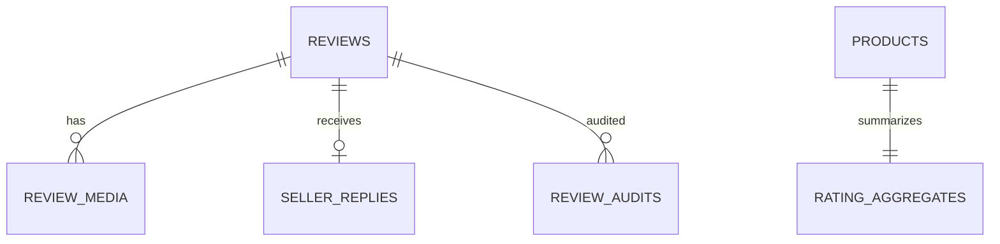

# Database — Rating & Comment Service

> Nguồn: `docs/lld/rating-comment.md` · HLD/Penpot · Cập nhật: `2026-08-30`
> Baseline: MongoDB 8.x + Mongoose `ratingdb`; review verified delivered, không pre-moderation

## 1. Quy ước chung

| Quy ước | Quyết định | Ràng buộc |
|---|---|---|
| ID | UUIDv7 string | Unique review/order-product-buyer. |
| Time | BSON Date UTC | API ISO-8601 UTC. |
| Source | Review/aggregate owned here | Order/Product IDs chỉ reference. |
| Media | S3/MinIO bytes, Mongo metadata | Signed URL/checksum; không lưu bytes. |
| Observability | JSON log/W3C trace/X-Request-ID | Không log comment/PII/token/signed URL. |
| Delete | Soft delete | Giữ audit/aggregate history. |

## 2. Quan hệ

Logical references không phải MongoDB FK.

## 3. Chi tiết collection

### 3.1 `reviews`

| Field | Type | Ràng buộc |
|---|---|---|
| `_id` | string | UUIDv7. |
| `product_id`,`shop_id`,`order_id`,`sku_id`,`buyer_user_id` | string | Required references. |
| `rating` | int | 1–5. |
| `comment` | string | Max 5.000 chars; sanitize. |
| `is_verified_purchase` | bool | Server-derived true; client không được set. |
| `status` | enum | `PUBLISHED/DELETED/HIDDEN`. |
| `version` | long | Optimistic update. |
| `created_at/updated_at` | Date | UTC. |

Unique baseline `(order_id,product_id,buyer_user_id)`.

### 3.2 `review_media`, `seller_replies`, `rating_aggregates`, `review_audits`

- `review_media`: media_id, review_id, object_key, content_type, size_bytes, sha256, sort_order, status; max 6, image ≤10 MiB.
- `seller_replies`: `_id`, review_id unique, shop_id, seller_user_id, content max 2.000, status, version, timestamps.
- `rating_aggregates`: `_id=product_id`, avg, count, distribution `{1..5}`, updated_at, source_version; count = sum distribution.
- `review_audits`: actor/action/target/reason/metadata/occurred_at; append-only, redacted.

## 4. Index

| Collection | Index |
|---|---|
| `reviews` | unique `(order_id,product_id,buyer_user_id)`; `(product_id,status,created_at)`; `(shop_id,status,created_at)`; `(buyer_user_id,created_at)` |
| `review_media` | `(review_id,status,sort_order)`; unique `object_key`; `(review_id,sha256)` |
| `seller_replies` | unique `review_id`; `(shop_id,updated_at)` |
| `rating_aggregates` | unique `product_id`; `(updated_at)` |
| `review_audits` | `(target_type,target_id,occurred_at)`; `(actor_user_id,occurred_at)` |

## 5. Enum và rules

Rating 1–5; only delivered verified order item; one review/order-product-buyer; public only `PUBLISHED`; aggregate ignores deleted; seller reply requires product shop ownership.

## 6. Migration và seed

1. Create review/media/reply/aggregate/audit collections and validators.
2. Duplicate preflight before unique index.
3. Seed delivered eligible, not-delivered, duplicate, all rating values, seller reply and aggregate distribution.
4. Recompute aggregate consistency; no KYC/token/comment sensitive fixture in logs.

## 7. Giả định & câu hỏi mở

| # | Nội dung | Ảnh hưởng nếu sai | Cần ai xác nhận |
|---|---|---|---|
| 1 | MongoDB/NestJS baseline; exact versions chưa chốt. | Ảnh hưởng schema/transaction/index. | Tech lead |
| 2 | Eligibility dựa delivered event + fallback Order contract chưa chốt. | Ảnh hưởng create review availability. | Order owner |
| 3 | Edit window 30 ngày/delete policy là baseline cần xác nhận. | Ảnh hưởng update/API. | Product owner |
| 4 | Không pre-moderation; hidden/report workflow tương lai. | Nếu compliance yêu cầu duyệt, cần state/queue. | Product/Security |
| 5 | Media scan provider chưa chốt. | Ảnh hưởng SCANNING→READY. | Security/DevOps |
