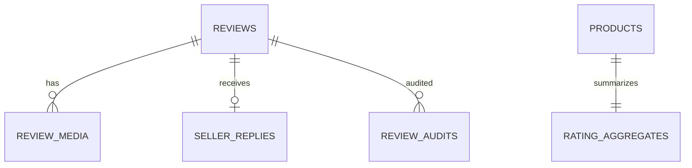

# Database — Rating & Comment Service

> Nguồn: `docs/lld/rating-comment.md` · HLD/Penpot · Cập nhật: `2026-08-30`
> Baseline: MongoDB 8.x + Mongoose `ratingdb`; review verified delivered, không pre-moderation

## 1. Quy ước chung

| Quy ước | Quyết định | Ràng buộc |
|---|---|---|
| ID | UUIDv7 string | Unique review/order-product-buyer. |
| Time | BSON Date UTC | API ISO-8601 UTC. |
| Source | Review/aggregate owned here | Order/Product IDs chỉ reference. |
| Media | S3/MinIO bytes, Mongo metadata | Signed URL/checksum; không lưu bytes. |
| Observability | JSON log/W3C trace/X-Request-ID | Không log comment/PII/token/signed URL. |
| Delete | Soft delete | Giữ audit/aggregate history. |

## 2. Quan hệ

Logical references không phải MongoDB FK.

## 3. Chi tiết collection

### 3.1 `reviews`

| Field | Type | Ràng buộc |
|---|---|---|
| `_id` | string | UUIDv7. |
| `product_id`,`shop_id`,`order_id`,`sku_id`,`buyer_user_id` | string | Required references. |
| `rating` | int | 1–5. |
| `comment` | string | Max 5.000 chars; sanitize. |
| `is_verified_purchase` | bool | Server-derived true; client không được set. |
| `status` | enum | `PUBLISHED/DELETED/HIDDEN`. |
| `version` | long | Optimistic update. |
| `created_at/updated_at` | Date | UTC. |

Unique baseline `(order_id,product_id,buyer_user_id)`.

### 3.2 `review_media`, `seller_replies`, `rating_aggregates`, `review_audits`

- `review_media`: media_id, review_id, object_key, content_type, size_bytes, sha256, sort_order, status; max 6, image ≤10 MiB.
- `seller_replies`: `_id`, review_id unique, shop_id, seller_user_id, content max 2.000, status, version, timestamps.
- `rating_aggregates`: `_id=product_id`, avg, count, distribution `{1..5}`, updated_at, source_version; count = sum distribution.
- `review_audits`: actor/action/target/reason/metadata/occurred_at; append-only, redacted.

## 4. Index

| Collection | Index |
|---|---|
| `reviews` | unique `(order_id,product_id,buyer_user_id)`; `(product_id,status,created_at)`; `(shop_id,status,created_at)`; `(buyer_user_id,created_at)` |
| `review_media` | `(review_id,status,sort_order)`; unique `object_key`; `(review_id,sha256)` |
| `seller_replies` | unique `review_id`; `(shop_id,updated_at)` |
| `rating_aggregates` | unique `product_id`; `(updated_at)` |
| `review_audits` | `(target_type,target_id,occurred_at)`; `(actor_user_id,occurred_at)` |

## 5. Enum và rules

Rating 1–5; only delivered verified order item; one review/order-product-buyer; public only `PUBLISHED`; aggregate ignores deleted; seller reply requires product shop ownership.

## 6. Migration và seed

### 6.1 Thứ tự migration

| Thứ tự | Nội dung | Phụ thuộc |
|---:|---|---|
| 001 | Tạo collection `reviews` + validator (`rating` 1–5, `status` enum) | — |
| 002 | Tạo collection `review_media` | `reviews` |
| 003 | Tạo collection `seller_replies` | `reviews` |
| 004 | Tạo collection `rating_aggregates` | — |
| 005 | Tạo collection `review_audits` | — |
| 006 | Duplicate preflight trên `reviews` theo `(order_id,product_id,buyer_user_id)` — migration fail nếu còn trùng | `reviews` |
| 007 | Tạo unique index `(order_id,product_id,buyer_user_id)` trên `reviews`, unique `object_key` trên `review_media`, unique `review_id` trên `seller_replies`, unique `product_id` trên `rating_aggregates` | 006 |
| 008 | Thêm index `(product_id,status,created_at)`, `(shop_id,status,created_at)` trên `reviews` | Tất cả bảng trên |
| 009 | Seed fixture cho local/test (§6.2) | Tất cả bảng trên |

### 6.2 Seed tối thiểu cho local/test

| Seed | Giá trị |
|---|---|
| `reviews` | Đủ 5 giá trị `rating` (1–5); 1 review tạo **ngay sau** `DELIVERED` và 1 review tạo **rất lâu sau** (test "không giới hạn thời gian tạo" — §3.2 API); 1 `DELETED`; 1 duplicate-attempt fixture (test `REVIEW_ALREADY_EXISTS`); 1 review trong edit window 30 ngày, 1 đã hết edit window. |
| `review_media` | 1 `READY`; 1 `SCANNING` (loại khỏi response public); 1 `REJECTED`. |
| `seller_replies` | 1 reply hợp lệ; 1 review chưa có reply (test tạo mới không trùng `REVIEW_REPLY_ALREADY_EXISTS`). |
| `rating_aggregates` | Khớp **chính xác** `count`/`distribution` với số `reviews` `PUBLISHED` fixture ở trên — đây là bất biến bắt buộc (`count = Σ distribution`), seed sai sẽ làm test aggregate fail ngay từ đầu. |

Không seed KYC document, token thật hoặc comment chứa PII trong fixture/log.

### 6.3 Kiểm tra bắt buộc trước khi chạy migration production

1. Duplicate preflight `(order_id,product_id,buyer_user_id)` phải sạch trước khi tạo unique index — migration dừng nếu còn bản ghi trùng, không tự xoá.
2. Recompute `rating_aggregates` từ `reviews` thật và so khớp — chênh lệch phải điều tra trước khi enable read traffic.

## 7. Giả định & câu hỏi mở

| # | Nội dung | Ảnh hưởng nếu sai | Cần ai xác nhận |
|---|---|---|---|
| 1 | MongoDB/NestJS baseline; exact versions chưa chốt. | Ảnh hưởng schema/transaction/index. | Tech lead |
| 2 | Eligibility dựa delivered event + fallback Order contract chưa chốt. | Ảnh hưởng create review availability. | Order owner |
| 3 | ~~Edit window baseline cần xác nhận~~ → **Đã chốt**: edit 30 ngày sau tạo; **tạo review không giới hạn thời gian** (chỉ cần `DELIVERED`) — xem `docs/api/rating-comment.md` §3.2/§3.3. | — | Đã đóng |
| 4 | Không pre-moderation; hidden/report workflow tương lai. | Nếu compliance yêu cầu duyệt, cần state/queue. | Product/Security |
| 5 | Media scan provider chưa chốt. | Ảnh hưởng SCANNING→READY. | Security/DevOps |
