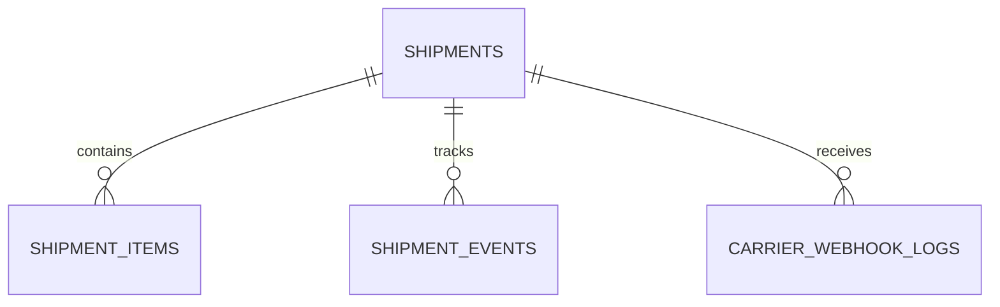

# Database — Shipment Service

> Nguồn: `docs/lld/shipment.md` · HLD/Penpot · Cập nhật: `2026-08-30`
> Baseline: MySQL 8.4/InnoDB `shipmentdb`; GHN + MOCK adapter

## 1. Quy ước chung

| Quy ước | Quyết định | Ràng buộc |
|---|---|---|
| ID | UUIDv7 API, `BINARY(16)` | Cross-service order/shop/user IDs không FK. |
| Time | `DATETIME(6)` UTC | API/event ISO-8601. |
| Snapshot | From/to address snapshot từ Order | Redact logs; không query UserDB. |
| Carrier event | `external_event_id` unique | Webhook at-least-once/idempotent. |
| Observability | JSON log/W3C trace/X-Request-ID | Không log secret/full address/raw webhook. |
| Secret | Secret manager | GHN credential không source/log. |

## 2. Quan hệ

## 3. Chi tiết bảng

### 3.1 `shipments`

`id`, `order_id`, `checkout_group_id`, `shop_id`, `buyer_user_id`, `carrier`, `tracking_code`, `status`, `from_address_snapshot`, `to_address_snapshot`, `shipping_fee`, `currency`, `external_shipment_id`, `version`, timestamps. Unique one shipment per shop-order baseline.

### 3.2 `shipment_items`

`id`, `shipment_id`, `sku_id`, `product_id`, `title_snapshot`, `quantity`, `weight_grams`, `created_at`. Quantity positive; snapshot immutable.

### 3.3 `shipment_events`

`id`, `shipment_id`, `canonical_status`, `carrier_status`, `description_safe`, `source`, `external_event_id`, `occurred_at`, `received_at`. Unique `(carrier,external_event_id)`; old status lưu diagnostic nhưng không làm state lùi.

### 3.4 `carrier_webhook_logs`, `idempotency_keys`

Webhook log giữ carrier/external ID/payload hash/signature result/status/timestamps; raw body không lưu hoặc encrypt theo policy. Idempotency giữ request hash/response snapshot 24h.

## 4. Index

| Bảng | Index |
|---|---|
| `shipments` | unique `(order_id,shop_id)`; unique `(carrier,tracking_code)`; `(buyer_user_id,created_at)`; `(shop_id,status,created_at)` |
| `shipment_items` | `(shipment_id)`; `(sku_id,created_at)` |
| `shipment_events` | `(shipment_id,occurred_at)`; unique `(carrier,external_event_id)` |
| `carrier_webhook_logs` | unique `(carrier,external_event_id)`; `(status,received_at)` |

## 5. Enum và rules

`ShipmentStatus`: `CREATED/PICKED_UP/IN_TRANSIT/DELIVERED/FAILED/CANCELLED/PENDING_RECONCILIATION`; `Carrier`: `GHN/MOCK`; tracking code unique; delivered không do client set.

## 6. Migration và seed

1. Tạo shipment/item/event/webhook/idempotency tables.
2. Unique/index preflight; seed GHN/MOCK state timeline, duplicate webhook và old status.
3. Reconcile one shop-order→one shipment, tracking uniqueness và event ordering.
4. Không seed GHN secret/address thật; cleanup webhook log theo retention policy.

## 7. Giả định & câu hỏi mở

| # | Nội dung | Ảnh hưởng nếu sai | Cần ai xác nhận |
|---|---|---|---|
| 1 | GHN sandbox + MOCK baseline. | Ảnh hưởng carrier mapping/signature. | Shipment/DevOps |
| 2 | Một shop-order có một shipment; multi-package chưa có. | Cần child package schema/API nếu bật. | Order owner |
| 3 | Address snapshot nhận từ Order. | Ảnh hưởng privacy/update address. | Security/Order owner |
| 4 | Carrier webhook authentication policy chưa chốt. | Cần signature/IP/secret rotation contract. | Security |
| 5 | Return/exchange chưa thuộc v1. | Cần lifecycle/fee/refund linkage. | Product/Finance |
